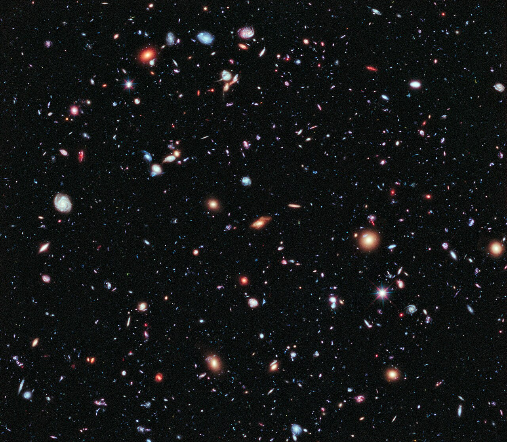
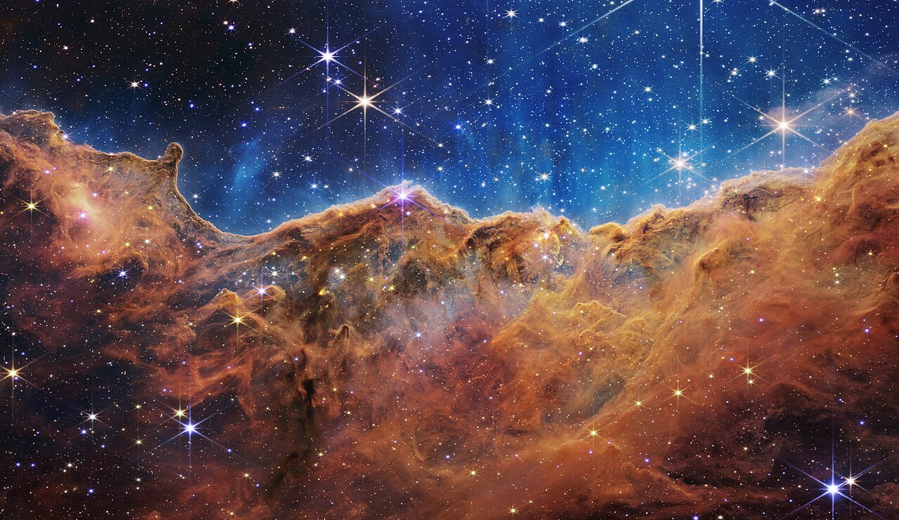

## {.hero-title-slide}

```{=html}
<div class="hero-layout">
  <div class="hero-copy">
    <div class="kicker">NeutrinoHit science pop</div>
    <h1>Рождение и жизнь Вселенной</h1>
    <div class="subtitle">Космическая биография: от горячего простого начала к галактикам, Земле и далекому будущему.</div>
    <div class="meta">
      Д. В. Наумов<br>
      Научно-популярная лекция для горожан<br>
      1 час
    </div>
  </div>
  <div class="hero-photo">
    
    <div class="photo-credit">NASA, ESA, CSA, STScI / Webb First Deep Field</div>
  </div>
</div>
```

# Глава 1. Сюжет лекции

## Главная мысль

:::: {.slide-split}

::: {.slide-copy}

Вселенная не родилась готовой сценой с готовыми объектами.

$$
\text{история Вселенной}
=
\text{расширение}
+
\text{охлаждение}
+
\text{рост структуры}.
$$

Все в лекции будет разверткой этой строки.

:::

::: {.slide-viz}
```{=html}
<div class="universe-viz" data-universe-viz="titleUniverse"></div>
```
:::

::::

## Три вопроса

:::: {.slide-split}

::: {.slide-copy}

::: {.compact}
- Что физики называют началом Вселенной?
- Почему сначала появились частицы, потом ядра, потом атомы, потом звезды?
- Как проверять историю, которая началась задолго до людей?
:::

::: {.takeaway}
Мы не смотрим на Вселенную снаружи. Мы читаем следы, оставленные внутри нее.
:::

:::

::: {.slide-viz}
```{=html}
<div class="universe-viz" data-universe-viz="timeline"></div>
```
:::

::::

## Часовой маршрут

:::: {.slide-split}

::: {.slide-copy}

::: {.compact}
1. 8 минут: что такое Большой взрыв и почему это не обычный взрыв.
2. 12 минут: горячая плазма, частицы, антиматерия и нейтрино.
3. 12 минут: первые ядра, первый свет и реликтовое излучение.
4. 15 минут: темные века, звезды, галактики, Солнце и Земля.
5. 10 минут: темная энергия, будущее и открытые вопросы.
6. 3 минуты: как все это проверяется.
:::

:::

::: {.slide-viz}
```{=html}
<div class="universe-viz" data-universe-viz="cooling"></div>
```
:::

::::

## Что честно отделяем

:::: {.slide-split}

::: {.slide-copy}

::: {.compact}
- Надежно измерено: расширение, реликтовое излучение, первые легкие элементы, рост структуры.
- Рабочая идея: очень ранняя инфляция как объяснение больших масштабов.
- Открыто: квантовое самое начало, темная материя, темная энергия, избыток материи.
:::

::: {.question}
Наука сильна не тем, что знает все, а тем, что умеет отделять знание от гипотез.
:::

:::

::: {.slide-viz}
```{=html}
<div class="photo-frame">
  
  <div class="photo-credit">NASA, ESA, Hubble XDF team</div>
</div>
```
:::

::::

# Глава 2. Большой взрыв

## Не взрыв в пустоте

:::: {.slide-split}

::: {.slide-copy}

Большой взрыв - это не шар огня, летящий в пустое пространство.

::: {.compact}
- Нет центральной точки, откуда все разлетелось.
- Расширяется сама геометрия расстояний.
- Любой далекий наблюдатель видит похожую картину.
:::

:::

::: {.slide-viz}
```{=html}
<div class="universe-viz" data-universe-viz="expansion"></div>
```
:::

::::

## Что значит горячее

:::: {.slide-split}

::: {.slide-copy}

В прошлом Вселенная была плотнее и горячее.

::: {.compact}
- Свет имел более короткие волны.
- Частицы чаще сталкивались.
- По мере охлаждения менялся состав того, что могло существовать устойчиво.
:::

Формула-ориентир:

$$
T \propto \frac{1}{a(t)}.
$$

:::

::: {.slide-viz}
```{=html}
<div class="universe-viz" data-universe-viz="cooling"></div>
```
:::

::::

## Почему это не фантазия

:::: {.slide-split}

::: {.slide-copy}

У ранней Вселенной есть последствия, которые можно измерять сегодня.

::: {.compact}
- Красное смещение говорит о расширении.
- Реликтовое излучение говорит о горячей плазме.
- Доля водорода и гелия говорит о первых минутах.
- Галактики показывают рост структуры.
:::

:::

::: {.slide-viz}
```{=html}
<div class="universe-viz" data-universe-viz="evidence"></div>
```
:::

::::

## Инфляционная идея

:::: {.slide-split}

::: {.slide-copy}

Очень раннее ускоренное расширение могло растянуть микроскопические флуктуации до космических размеров.

::: {.compact}
- Это объясняет, почему небо почти одинаково во всех направлениях.
- Это дает семена будущих галактик.
- Детали конкретной инфляционной модели все еще обсуждаются.
:::

:::

::: {.slide-viz}
```{=html}
<div class="universe-viz" data-universe-viz="cmb"></div>
```
:::

::::

# Глава 3. Первые частицы

## Без привычных объектов

:::: {.slide-split}

::: {.slide-copy}

В первые эпохи нет атомов, планет и даже устойчивых ядер.

::: {.compact}
- Есть плотная смесь частиц и излучения.
- Частицы рождаются и исчезают в столкновениях.
- Слово "вещество" здесь еще не похоже на наш повседневный опыт.
:::

:::

::: {.slide-viz}
```{=html}
<div class="universe-viz" data-universe-viz="particleSoup"></div>
```
:::

::::

## Материя победила антиматерию

:::: {.slide-split}

::: {.slide-copy}

Сегодня вокруг нас почти нет антивещества.

::: {.compact}
- В ранней Вселенной частицы и античастицы рождались парами.
- Почти все они аннигилировали обратно в свет.
- Малый избыток материи стал атомами, звездами и нами.
:::

::: {.question}
Почему этот избыток появился - один из больших открытых вопросов.
:::

:::

::: {.slide-viz}
```{=html}
<div class="universe-viz" data-universe-viz="asymmetry"></div>
```
:::

::::

## Нейтрино уходят

:::: {.slide-split}

::: {.slide-copy}

Когда Вселенная остыла, нейтрино перестали часто сталкиваться с плазмой.

::: {.compact}
- С этого момента они почти свободно летят через космос.
- Реликтовые нейтрино должны существовать.
- Напрямую поймать их крайне трудно: они слишком слабо взаимодействуют.
:::

:::

::: {.slide-viz}
```{=html}
<div class="universe-viz" data-universe-viz="neutrinos"></div>
```
:::

::::

## Ранняя Вселенная как лаборатория

:::: {.slide-split}

::: {.slide-copy}

Чем выше температура, тем выше типичная энергия столкновений.

::: {.compact}
- Космос проверял физику, которую трудно повторить в земной лаборатории.
- Лаборатория проверяет правила, по которым мы читаем космические следы.
- Поэтому космология и физика частиц постоянно разговаривают друг с другом.
:::

:::

::: {.slide-viz}
```{=html}
<div class="universe-viz" data-universe-viz="particleSoup"></div>
```
:::

::::

# Глава 4. Первые ядра

## Что успело собраться

:::: {.slide-split}

::: {.slide-copy}

Первые устойчивые легкие ядра возникли, когда Вселенная стала достаточно холодной.

::: {.compact}
- Водород - главный строительный материал.
- Гелий-4 - около четверти обычного вещества по массе.
- Дейтерий и литий - малые, но важные следы ранней физики.
:::

:::

::: {.slide-viz}
```{=html}
<div class="universe-viz" data-universe-viz="nuclei"></div>
```
:::

::::

## Почему не железо

:::: {.slide-split}

::: {.slide-copy}

Ранняя Вселенная не успела сделать тяжелые элементы.

::: {.compact}
- Она быстро расширялась и остывала.
- Плотность падала слишком быстро.
- Для углерода, кислорода и железа понадобились звезды.
:::

::: {.takeaway}
Первые минуты дали простую химию. Сложную химию доделали звезды.
:::

:::

::: {.slide-viz}
```{=html}
<div class="universe-viz" data-universe-viz="stars"></div>
```
:::

::::

## Почему это проверяемо

:::: {.slide-split}

::: {.slide-copy}

Доля легких элементов - не украшение рассказа, а измеряемый след.

::: {.compact}
- Слишком много нейтронов - изменится доля гелия.
- Слишком быстрый или медленный темп расширения - изменится состав.
- Дейтерий особенно чувствителен к плотности обычного вещества.
:::

:::

::: {.slide-viz}
```{=html}
<div class="universe-viz" data-universe-viz="evidence"></div>
```
:::

::::

# Глава 5. Первый свет

## До прозрачности

:::: {.slide-split}

::: {.slide-copy}

Пока свободных электронов много, свет не проходит далеко.

::: {.compact}
- Фотон постоянно рассеивается.
- Вселенная похожа на светящийся туман.
- Увидеть более ранний свет напрямую нельзя обычными телескопами.
:::

:::

::: {.slide-viz}
```{=html}
<div class="universe-viz" data-universe-viz="recombination"></div>
```
:::

::::

## Атомы и свободный свет

:::: {.slide-split}

::: {.slide-copy}

Когда электроны соединяются с ядрами, возникают нейтральные атомы.

::: {.compact}
- Свету становится почти не на чем рассеиваться.
- Он уходит в свободный полет.
- Сегодня мы видим этот свет как реликтовое излучение.
:::

$$
p + e^- \rightarrow \mathrm{H} + \gamma.
$$

:::

::: {.slide-viz}
```{=html}
<div class="universe-viz" data-universe-viz="recombination"></div>
```
:::

::::

## Реликтовое излучение

:::: {.slide-split}

::: {.slide-copy}

Это фотография Вселенной в возрасте примерно 380 тысяч лет.

::: {.compact}
- Тогда температура была несколько тысяч кельвинов.
- Сейчас из-за расширения это всего около 2.7 K.
- Пятна на карте - очень малые отклонения температуры.
:::

:::

::: {.slide-viz}
```{=html}
<div class="photo-frame">
  
  <div class="photo-credit">ESA / Planck Collaboration</div>
</div>
```
:::

::::

## Не идеально гладкое

:::: {.slide-split}

::: {.slide-copy}

Если бы все было идеально одинаковым, галактикам было бы не из чего вырасти.

::: {.compact}
- Малые флуктуации плотности усиливались гравитацией.
- Неровности в реликтовом излучении - ранние семена структуры.
- Масштаб эффекта мал: примерно одна стотысячная.
:::

$$
\frac{\Delta T}{T} \sim 10^{-5}.
$$

:::

::: {.slide-viz}
```{=html}
<div class="universe-viz" data-universe-viz="cmb"></div>
```
:::

::::

# Глава 6. Темные века и первые звезды

## Темные века

:::: {.slide-split}

::: {.slide-copy}

После реликтового излучения атомы уже есть, но звезд еще нет.

::: {.compact}
- Видимого света почти некому производить.
- Газ медленно собирается гравитацией.
- Нужны первые плотные облака, чтобы зажглись звезды.
:::

:::

::: {.slide-viz}
```{=html}
<div class="universe-viz" data-universe-viz="darkMatter"></div>
```
:::

::::

## Темная материя

:::: {.slide-split}

::: {.slide-copy}

Темная материя не рассеивает свет, но дает гравитационные ямы.

::: {.compact}
- Обычный газ падает в эти ямы.
- Там он охлаждается и сжимается.
- Так невидимое помогает видимому стать структурированным.
:::

::: {.question}
Мы видим роль темной материи по гравитации, но не знаем, из каких частиц она состоит.
:::

:::

::: {.slide-viz}
```{=html}
<div class="universe-viz" data-universe-viz="darkMatter"></div>
```
:::

::::

## Первые звезды

:::: {.slide-split}

::: {.slide-copy}

Первые звезды были почти без тяжелых элементов.

::: {.compact}
- Многие из них, вероятно, были массивными и короткоживущими.
- Их взрывы впервые обогатили космос тяжелыми ядрами.
- С этого момента появляется материал для планет.
:::

:::

::: {.slide-viz}
```{=html}
<div class="photo-frame">
  
  <div class="photo-credit">NASA, ESA, CSA, STScI / Webb Cosmic Cliffs</div>
</div>
```
:::

::::

## Звезды как фабрики

:::: {.slide-split}

::: {.slide-copy}

Звезда - это не просто лампа в небе.

::: {.compact}
- Внутри звезд идут ядерные реакции.
- Взрывы и ветры возвращают вещество в межзвездную среду.
- Новые поколения звезд и планет рождаются уже из обогащенного газа.
:::

:::

::: {.slide-viz}
```{=html}
<div class="universe-viz" data-universe-viz="stars"></div>
```
:::

::::

# Глава 7. Галактики

## Космическая паутина

:::: {.slide-split}

::: {.slide-copy}

На больших масштабах вещество распределено не случайной кашей.

::: {.compact}
- Есть нити.
- Есть узлы - скопления и сверхскопления.
- Есть пустоты.
:::

::: {.takeaway}
Это взрослая версия тех самых малых неровностей ранней Вселенной.
:::

:::

::: {.slide-viz}
```{=html}
<div class="universe-viz" data-universe-viz="web"></div>
```
:::

::::

## Галактики растут

:::: {.slide-split}

::: {.slide-copy}

Галактики не появляются сразу готовыми.

::: {.compact}
- Малые сгустки сливаются в более крупные.
- Газ охлаждается, вращается и образует диски.
- Черные дыры в центрах галактик растут вместе с окружением.
:::

:::

::: {.slide-viz}
```{=html}
<div class="photo-frame">
  
  <div class="photo-credit">NASA, ESA, Hubble XDF team</div>
</div>
```
:::

::::

## Млечный Путь

:::: {.slide-split}

::: {.slide-copy}

Наша Галактика - поздняя, долго собиравшаяся глава.

::: {.compact}
- Несколько поколений звезд обогатили газ тяжелыми элементами.
- Из такого газа позже возникли Солнце и планеты.
- Земная химия - результат длинной космической переработки вещества.
:::

:::

::: {.slide-viz}
```{=html}
<div class="universe-viz" data-universe-viz="solarSystem"></div>
```
:::

::::

# Глава 8. Солнце, Земля, жизнь

## Солнечная система

:::: {.slide-split}

::: {.slide-copy}

Около 4.6 млрд лет назад сжалось облако газа и пыли.

::: {.compact}
- В центре зажглось Солнце.
- Остатки диска стали планетами, астероидами и кометами.
- Внутри этого диска уже были тяжелые элементы от старых звезд.
:::

:::

::: {.slide-viz}
```{=html}
<div class="universe-viz" data-universe-viz="solarSystem"></div>
```
:::

::::

## Земля как лаборатория

:::: {.slide-split}

::: {.slide-copy}

Земля важна не потому, что она центр Вселенной.

::: {.compact}
- Она собрала тяжелые элементы, воду, атмосферу и геологию.
- На ней возникла сложная химия.
- Жизнь стала частью космической истории вещества.
:::

::: {.takeaway}
Мы сделаны из вещества, которое Вселенная не умела делать в первые минуты.
:::

:::

::: {.slide-viz}
```{=html}
<div class="universe-viz" data-universe-viz="stars"></div>
```
:::

::::

## Наблюдатель появляется поздно

:::: {.slide-split}

::: {.slide-copy}

Большая часть истории Вселенной прошла без планет, биологии и наблюдателей.

::: {.compact}
- Но физические следы ранних эпох сохранились.
- Свет, химический состав и движение галактик доступны измерению.
- Поэтому поздний наблюдатель может восстановить раннюю историю.
:::

:::

::: {.slide-viz}
```{=html}
<div class="universe-viz" data-universe-viz="timeline"></div>
```
:::

::::

# Глава 9. Темная энергия и будущее

## Расширение ускоряется

:::: {.slide-split}

::: {.slide-copy}

В конце XX века оказалось, что расширение Вселенной сейчас ускоряется.

::: {.compact}
- Далекие сверхновые оказались слабее, чем ожидалось для замедляющейся Вселенной.
- Реликтовое излучение и крупномасштабная структура поддерживают эту картину.
- В простейшем описании это темная энергия или космологическая постоянная.
:::

:::

::: {.slide-viz}
```{=html}
<div class="universe-viz" data-universe-viz="darkEnergy"></div>
```
:::

::::

## Что это меняет

:::: {.slide-split}

::: {.slide-copy}

Темная энергия не разрывает Солнечную систему.

::: {.compact}
- Галактики, звезды и планеты на малых масштабах связаны гравитацией.
- На космологических масштабах расстояния между скоплениями растут быстрее.
- Очень далекое будущее становится холоднее и темнее.
:::

:::

::: {.slide-viz}
```{=html}
<div class="universe-viz" data-universe-viz="future"></div>
```
:::

::::

## Далекое будущее

:::: {.slide-split}

::: {.slide-copy}

В простейшем сценарии:

::: {.compact}
- звездообразование со временем почти прекратится;
- останутся долгоживущие слабые звезды, остатки звезд и черные дыры;
- будущим наблюдателям будет труднее увидеть далекую Вселенную.
:::

::: {.question}
Но чем дальше в будущее, тем сильнее ответ зависит от неизвестной физики.
:::

:::

::: {.slide-viz}
```{=html}
<div class="universe-viz" data-universe-viz="future"></div>
```
:::

::::

## Открытые вопросы

:::: {.slide-split}

::: {.slide-copy}

Остались вопросы, которые не являются мелкими поправками.

::: {.compact}
- Что было в самой ранней квантово-гравитационной эпохе?
- Почему материи чуть больше, чем антиматерии?
- Что такое темная материя?
- Что такое темная энергия?
- Единственна ли наша космическая история?
:::

:::

::: {.slide-viz}
```{=html}
<div class="universe-viz" data-universe-viz="titleUniverse"></div>
```
:::

::::

# Глава 10. Как мы это знаем

## Четыре главных следа

:::: {.slide-split}

::: {.slide-copy}

Космология убедительна, когда разные следы дают одну историю.

::: {.compact}
- Расширение: красные смещения галактик.
- Реликтовое излучение: фотография ранней плазмы.
- Первичный химический состав: след первых минут.
- Рост структуры: галактики, скопления, линзирование.
:::

:::

::: {.slide-viz}
```{=html}
<div class="universe-viz" data-universe-viz="evidence"></div>
```
:::

::::

## Одна история, разные приборы

:::: {.slide-split}

::: {.slide-copy}

Разные наблюдения проверяют разные эпохи.

::: {.compact}
- Телескопы видят свет и галактики.
- Спектры говорят о химическом составе.
- Карты реликтового излучения видят ранние флуктуации.
- Физика частиц задает правила микромира.
:::

:::

::: {.slide-viz}
```{=html}
<div class="photo-frame">
  
  <div class="photo-credit">ESA / Planck Collaboration</div>
</div>
```
:::

::::

## Самый честный финал

:::: {.slide-split}

::: {.slide-copy}

Мы не знаем Вселенную снаружи.

::: {.compact}
- Но внутри нее сохранились следы.
- Эти следы складываются в связанную биографию.
- Чем ближе к самому началу и чем дальше в будущее, тем честнее говорить об открытых вопросах.
:::

::: {.takeaway}
История Вселенной - это не миф о начале, а проверяемая реконструкция по следам.
:::

:::

::: {.slide-viz}
```{=html}
<div class="universe-viz" data-universe-viz="titleUniverse"></div>
```
:::

::::

# Глава 11. Источники визуалов

## Credits

:::: {.image-split}

::: {.source-list}

::: {.compact}
- Webb First Deep Field: NASA, ESA, CSA, STScI. Local copy from Wikimedia Commons: <https://commons.wikimedia.org/wiki/File:Webb%27s_First_Deep_Field.jpg>
- Webb Cosmic Cliffs: NASA, ESA, CSA, STScI. Local copy from Wikimedia Commons: <https://commons.wikimedia.org/wiki/File:NASA%E2%80%99s_Webb_Reveals_Cosmic_Cliffs,_Glittering_Landscape_of_Star_Birth.jpg>
- Hubble eXtreme Deep Field: NASA, ESA, G. Illingworth, D. Magee, P. Oesch, R. Bouwens, HUDF09 Team. Local copy from Wikimedia Commons: <https://commons.wikimedia.org/wiki/File:The_Hubble_eXtreme_Deep_Field.jpg>
- CMB map: ESA / Planck Collaboration. Local copy from Wikimedia Commons: <https://commons.wikimedia.org/wiki/File:Cosmic_Microwave_Background_(CMB).jpeg>
- All schematic animations in these slides are generated locally in `assets/universe-lecture.js`.
:::

:::

::: {.slide-viz}
```{=html}
<div class="universe-viz" data-universe-viz="evidence"></div>
```
:::

::::
