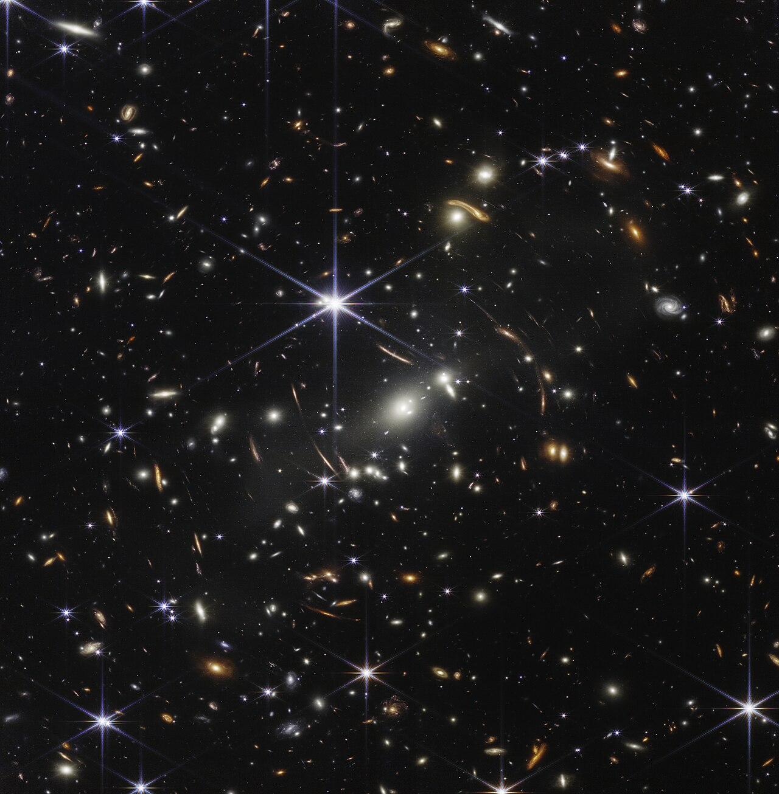
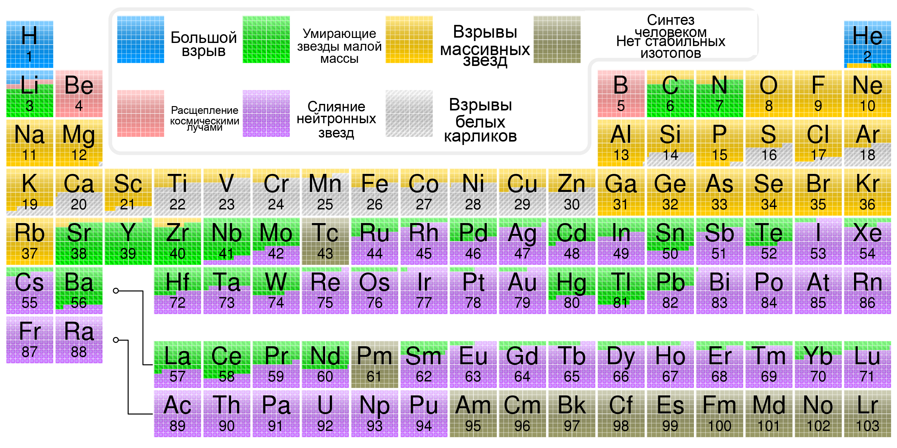
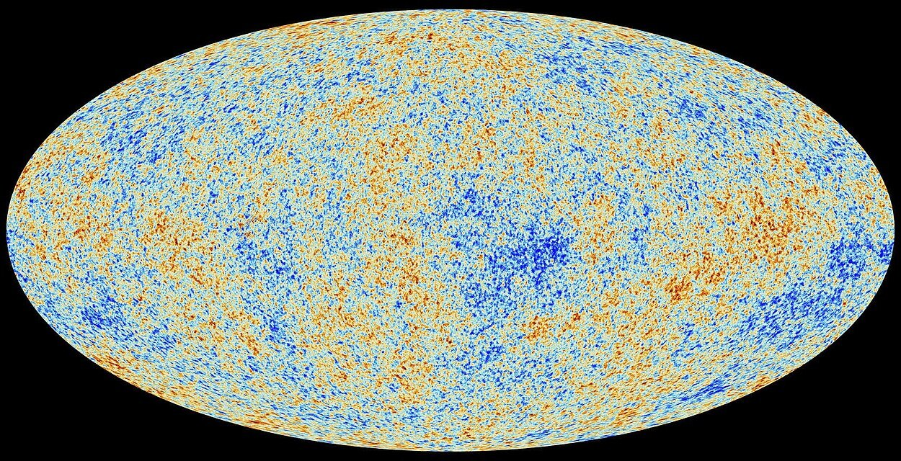

## {.hero-title-slide}

```{=html}
<div class="hero-layout">
  <div class="hero-copy">
    <h1>Рождение и жизнь одной Вселенной</h1>
    <div class="meta">
      Д. В. Наумов<br>
      Научно-популярная лекция для горожан<br>
    </div>
  </div>
  <div class="hero-photo">
    
    <div class="photo-credit">NASA, ESA, CSA, STScI / Webb First Deep Field</div>
  </div>
</div>
```


# Глава 1. Почему ночью небо темное?

## {.olbers-section data-auto-animate=true}

```{=html}
<div class="olbers-slide" data-id="olbers-slide" style="--sky-light: 0; --cone: 0; --plane-1: 0; --plane-2: 0; --plane-3: 0; --plane-4: 0; --hit-rays: 0; --whiteout: 0;">
  <div class="olbers-sky" data-id="olbers-sky"></div>
  <svg class="olbers-diagram" viewBox="0 0 1280 650" aria-hidden="true" data-id="olbers-diagram">
    <g class="olbers-cone-lines" data-id="cone-lines">
      <polygon class="olbers-cone-side" points="126,560 715,120 1080,105 1080,515 715,500"></polygon>
      <path class="olbers-cone-edge" d="M126 560 L715 120 M126 560 L1080 105 M126 560 L1080 515 M126 560 L715 500"></path>
      <path class="olbers-central-ray" d="M126 560 L900 330"></path>
    </g>
    <g class="olbers-hit-rays" data-id="hit-rays">
      <line x1="126" y1="560" x2="780" y2="180"></line>
      <line x1="126" y1="560" x2="900" y2="170"></line>
      <line x1="126" y1="560" x2="1010" y2="190"></line>
      <line x1="126" y1="560" x2="760" y2="280"></line>
      <line x1="126" y1="560" x2="885" y2="275"></line>
      <line x1="126" y1="560" x2="1005" y2="300"></line>
      <line x1="126" y1="560" x2="780" y2="390"></line>
      <line x1="126" y1="560" x2="900" y2="390"></line>
      <line x1="126" y1="560" x2="1010" y2="430"></line>
    </g>
    <g class="olbers-plane olbers-plane-4" data-id="plane-4">
      <polygon class="olbers-plane-face" points="715,120 1080,105 1080,515 715,500"></polygon>
      <path class="olbers-plane-grid" d="M806 116 L806 504 M897 112 L897 508 M989 109 L989 512 M715 222 L1080 207 M715 325 L1080 310 M715 428 L1080 413"></path>
      <circle class="olbers-star" cx="780" cy="180" r="13"></circle>
      <circle class="olbers-star" cx="900" cy="170" r="13"></circle>
      <circle class="olbers-star" cx="1010" cy="190" r="13"></circle>
      <circle class="olbers-star" cx="760" cy="280" r="13"></circle>
      <circle class="olbers-star" cx="885" cy="275" r="13"></circle>
      <circle class="olbers-star" cx="1005" cy="300" r="13"></circle>
      <circle class="olbers-star" cx="780" cy="390" r="13"></circle>
      <circle class="olbers-star" cx="900" cy="390" r="13"></circle>
      <circle class="olbers-star" cx="1010" cy="430" r="13"></circle>
    </g>
    <g class="olbers-plane olbers-plane-3" data-id="plane-3">
      <polygon class="olbers-plane-face" points="507,274 744,264 744,531 507,521"></polygon>
      <path class="olbers-plane-grid" d="M586 271 L586 524 M665 268 L665 528 M507 363 L744 353 M507 452 L744 442"></path>
      <circle class="olbers-star" cx="565" cy="330" r="12"></circle>
      <circle class="olbers-star" cx="640" cy="315" r="12"></circle>
      <circle class="olbers-star" cx="704" cy="344" r="12"></circle>
      <circle class="olbers-star" cx="565" cy="425" r="12"></circle>
      <circle class="olbers-star" cx="627" cy="410" r="12"></circle>
      <circle class="olbers-star" cx="704" cy="443" r="12"></circle>
      <circle class="olbers-star" cx="570" cy="500" r="12"></circle>
      <circle class="olbers-star" cx="650" cy="490" r="12"></circle>
    </g>
    <g class="olbers-plane olbers-plane-2" data-id="plane-2">
      <polygon class="olbers-plane-face" points="382,366 542,360 542,540 382,534"></polygon>
      <path class="olbers-plane-grid" d="M435 364 L435 536 M489 362 L489 538 M382 426 L542 420 M382 486 L542 480"></path>
      <circle class="olbers-star" cx="430" cy="410" r="12"></circle>
      <circle class="olbers-star" cx="500" cy="400" r="12"></circle>
      <circle class="olbers-star" cx="463" cy="459" r="12"></circle>
      <circle class="olbers-star" cx="430" cy="500" r="12"></circle>
      <circle class="olbers-star" cx="510" cy="505" r="12"></circle>
    </g>
    <g class="olbers-plane olbers-plane-1" data-id="plane-1">
      <polygon class="olbers-plane-face" points="257,459 341,455 341,550 257,546"></polygon>
      <path class="olbers-plane-grid" d="M285 458 L285 547 M313 456 L313 549 M257 488 L341 486 M257 517 L341 518"></path>
      <circle class="olbers-star" cx="299" cy="507" r="12"></circle>
    </g>
    <g class="olbers-observer-symbol" transform="translate(72 498)">
      <circle class="olbers-observer-head" cx="54" cy="54" r="45"></circle>
      <path class="olbers-observer-eye" d="M28 58 C48 28 79 29 96 54 C76 73 48 78 28 58 Z"></path>
      <circle class="olbers-observer-pupil" cx="77" cy="53" r="8"></circle>
    </g>
  </svg>
  <div class="olbers-copy" data-id="olbers-copy">
    <div class="olbers-kicker" data-id="olbers-kicker">вопрос</div>
    <div class="olbers-title" data-id="olbers-title">Почему ночью небо темное?</div>
    <div class="olbers-caption" data-id="olbers-caption">На первый взгляд ответ очевиден: Солнце за горизонтом. Но тогда остается более глубокий вопрос.</div>
  </div>
</div>
```

## {.olbers-section data-auto-animate=true}

```{=html}
<div class="olbers-slide" data-id="olbers-slide" style="--sky-light: 0.08; --cone: 0.78; --plane-1: 0.96; --plane-2: 0; --plane-3: 0; --plane-4: 0; --hit-rays: 0; --whiteout: 0;">
  <div class="olbers-sky" data-id="olbers-sky"></div>
  <svg class="olbers-diagram" viewBox="0 0 1280 650" aria-hidden="true" data-id="olbers-diagram">
    <g class="olbers-cone-lines" data-id="cone-lines">
      <polygon class="olbers-cone-side" points="126,560 715,120 1080,105 1080,515 715,500"></polygon>
      <path class="olbers-cone-edge" d="M126 560 L715 120 M126 560 L1080 105 M126 560 L1080 515 M126 560 L715 500"></path>
      <path class="olbers-central-ray" d="M126 560 L900 330"></path>
    </g>
    <g class="olbers-hit-rays" data-id="hit-rays">
      <line x1="126" y1="560" x2="780" y2="180"></line><line x1="126" y1="560" x2="900" y2="170"></line><line x1="126" y1="560" x2="1010" y2="190"></line><line x1="126" y1="560" x2="760" y2="280"></line><line x1="126" y1="560" x2="885" y2="275"></line><line x1="126" y1="560" x2="1005" y2="300"></line><line x1="126" y1="560" x2="780" y2="390"></line><line x1="126" y1="560" x2="900" y2="390"></line><line x1="126" y1="560" x2="1010" y2="430"></line>
    </g>
    <g class="olbers-plane olbers-plane-4" data-id="plane-4"><polygon class="olbers-plane-face" points="715,120 1080,105 1080,515 715,500"></polygon><path class="olbers-plane-grid" d="M806 116 L806 504 M897 112 L897 508 M989 109 L989 512 M715 222 L1080 207 M715 325 L1080 310 M715 428 L1080 413"></path><circle class="olbers-star" cx="780" cy="180" r="13"></circle><circle class="olbers-star" cx="900" cy="170" r="13"></circle><circle class="olbers-star" cx="1010" cy="190" r="13"></circle><circle class="olbers-star" cx="760" cy="280" r="13"></circle><circle class="olbers-star" cx="885" cy="275" r="13"></circle><circle class="olbers-star" cx="1005" cy="300" r="13"></circle><circle class="olbers-star" cx="780" cy="390" r="13"></circle><circle class="olbers-star" cx="900" cy="390" r="13"></circle><circle class="olbers-star" cx="1010" cy="430" r="13"></circle></g>
    <g class="olbers-plane olbers-plane-3" data-id="plane-3"><polygon class="olbers-plane-face" points="507,274 744,264 744,531 507,521"></polygon><path class="olbers-plane-grid" d="M586 271 L586 524 M665 268 L665 528 M507 363 L744 353 M507 452 L744 442"></path><circle class="olbers-star" cx="565" cy="330" r="12"></circle><circle class="olbers-star" cx="640" cy="315" r="12"></circle><circle class="olbers-star" cx="704" cy="344" r="12"></circle><circle class="olbers-star" cx="565" cy="425" r="12"></circle><circle class="olbers-star" cx="627" cy="410" r="12"></circle><circle class="olbers-star" cx="704" cy="443" r="12"></circle><circle class="olbers-star" cx="570" cy="500" r="12"></circle><circle class="olbers-star" cx="650" cy="490" r="12"></circle></g>
    <g class="olbers-plane olbers-plane-2" data-id="plane-2"><polygon class="olbers-plane-face" points="382,366 542,360 542,540 382,534"></polygon><path class="olbers-plane-grid" d="M435 364 L435 536 M489 362 L489 538 M382 426 L542 420 M382 486 L542 480"></path><circle class="olbers-star" cx="430" cy="410" r="12"></circle><circle class="olbers-star" cx="500" cy="400" r="12"></circle><circle class="olbers-star" cx="463" cy="459" r="12"></circle><circle class="olbers-star" cx="430" cy="500" r="12"></circle><circle class="olbers-star" cx="510" cy="505" r="12"></circle></g>
    <g class="olbers-plane olbers-plane-1" data-id="plane-1"><polygon class="olbers-plane-face" points="257,459 341,455 341,550 257,546"></polygon><path class="olbers-plane-grid" d="M285 458 L285 547 M313 456 L313 549 M257 488 L341 486 M257 517 L341 518"></path><circle class="olbers-star" cx="299" cy="507" r="12"></circle></g>
    <g class="olbers-observer-symbol" transform="translate(72 498)"><circle class="olbers-observer-head" cx="54" cy="54" r="45"></circle><path class="olbers-observer-eye" d="M28 58 C48 28 79 29 96 54 C76 73 48 78 28 58 Z"></path><circle class="olbers-observer-pupil" cx="77" cy="53" r="8"></circle></g>
  </svg>
  <div class="olbers-copy" data-id="olbers-copy">
    <div class="olbers-kicker" data-id="olbers-kicker">модель</div>
    <div class="olbers-title" data-id="olbers-title">Представим вечную и статическую Вселенную</div>
    <div class="olbers-caption" data-id="olbers-caption">Звезды равномерно заполняют пространство. Наблюдатель смотрит в любую сторону.</div>
  </div>
</div>
```

## {.olbers-section data-auto-animate=true}

```{=html}
<div class="olbers-slide" data-id="olbers-slide" style="--sky-light: 0.18; --cone: 0.86; --plane-1: 1; --plane-2: 0.92; --plane-3: 0; --plane-4: 0; --hit-rays: 0.14; --whiteout: 0.02;">
  <div class="olbers-sky" data-id="olbers-sky"></div>
  <svg class="olbers-diagram" viewBox="0 0 1280 650" aria-hidden="true" data-id="olbers-diagram">
    <g class="olbers-cone-lines" data-id="cone-lines"><polygon class="olbers-cone-side" points="126,560 715,120 1080,105 1080,515 715,500"></polygon><path class="olbers-cone-edge" d="M126 560 L715 120 M126 560 L1080 105 M126 560 L1080 515 M126 560 L715 500"></path><path class="olbers-central-ray" d="M126 560 L900 330"></path></g>
    <g class="olbers-hit-rays" data-id="hit-rays"><line x1="126" y1="560" x2="780" y2="180"></line><line x1="126" y1="560" x2="900" y2="170"></line><line x1="126" y1="560" x2="1010" y2="190"></line><line x1="126" y1="560" x2="760" y2="280"></line><line x1="126" y1="560" x2="885" y2="275"></line><line x1="126" y1="560" x2="1005" y2="300"></line><line x1="126" y1="560" x2="780" y2="390"></line><line x1="126" y1="560" x2="900" y2="390"></line><line x1="126" y1="560" x2="1010" y2="430"></line></g>
    <g class="olbers-plane olbers-plane-4" data-id="plane-4"><polygon class="olbers-plane-face" points="715,120 1080,105 1080,515 715,500"></polygon><path class="olbers-plane-grid" d="M806 116 L806 504 M897 112 L897 508 M989 109 L989 512 M715 222 L1080 207 M715 325 L1080 310 M715 428 L1080 413"></path><circle class="olbers-star" cx="780" cy="180" r="13"></circle><circle class="olbers-star" cx="900" cy="170" r="13"></circle><circle class="olbers-star" cx="1010" cy="190" r="13"></circle><circle class="olbers-star" cx="760" cy="280" r="13"></circle><circle class="olbers-star" cx="885" cy="275" r="13"></circle><circle class="olbers-star" cx="1005" cy="300" r="13"></circle><circle class="olbers-star" cx="780" cy="390" r="13"></circle><circle class="olbers-star" cx="900" cy="390" r="13"></circle><circle class="olbers-star" cx="1010" cy="430" r="13"></circle></g>
    <g class="olbers-plane olbers-plane-3" data-id="plane-3"><polygon class="olbers-plane-face" points="507,274 744,264 744,531 507,521"></polygon><path class="olbers-plane-grid" d="M586 271 L586 524 M665 268 L665 528 M507 363 L744 353 M507 452 L744 442"></path><circle class="olbers-star" cx="565" cy="330" r="12"></circle><circle class="olbers-star" cx="640" cy="315" r="12"></circle><circle class="olbers-star" cx="704" cy="344" r="12"></circle><circle class="olbers-star" cx="565" cy="425" r="12"></circle><circle class="olbers-star" cx="627" cy="410" r="12"></circle><circle class="olbers-star" cx="704" cy="443" r="12"></circle><circle class="olbers-star" cx="570" cy="500" r="12"></circle><circle class="olbers-star" cx="650" cy="490" r="12"></circle></g>
    <g class="olbers-plane olbers-plane-2" data-id="plane-2"><polygon class="olbers-plane-face" points="382,366 542,360 542,540 382,534"></polygon><path class="olbers-plane-grid" d="M435 364 L435 536 M489 362 L489 538 M382 426 L542 420 M382 486 L542 480"></path><circle class="olbers-star" cx="430" cy="410" r="12"></circle><circle class="olbers-star" cx="500" cy="400" r="12"></circle><circle class="olbers-star" cx="463" cy="459" r="12"></circle><circle class="olbers-star" cx="430" cy="500" r="12"></circle><circle class="olbers-star" cx="510" cy="505" r="12"></circle></g>
    <g class="olbers-plane olbers-plane-1" data-id="plane-1"><polygon class="olbers-plane-face" points="257,459 341,455 341,550 257,546"></polygon><path class="olbers-plane-grid" d="M285 458 L285 547 M313 456 L313 549 M257 488 L341 486 M257 517 L341 518"></path><circle class="olbers-star" cx="299" cy="507" r="12"></circle></g>
    <g class="olbers-observer-symbol" transform="translate(72 498)"><circle class="olbers-observer-head" cx="54" cy="54" r="45"></circle><path class="olbers-observer-eye" d="M28 58 C48 28 79 29 96 54 C76 73 48 78 28 58 Z"></path><circle class="olbers-observer-pupil" cx="77" cy="53" r="8"></circle></g>
  </svg>
  <div class="olbers-copy" data-id="olbers-copy">
    <div class="olbers-kicker" data-id="olbers-kicker">звездные оболочки</div>
    <div class="olbers-title" data-id="olbers-title">Чем дальше слой, тем больше в нем звезд</div>
    <div class="olbers-caption" data-id="olbers-caption">Дальние звезды слабее, но самих звезд в дальнем слое больше. В простейшей картине эти эффекты компенсируются.</div>
    <div class="olbers-equation" data-id="olbers-equation">тот же угол зрения -> площадь слоя растет как r²</div>
  </div>
</div>
```

## {.olbers-section data-auto-animate=true}

```{=html}
<div class="olbers-slide" data-id="olbers-slide" style="--sky-light: 0.42; --cone: 0.92; --plane-1: 1; --plane-2: 1; --plane-3: 0.92; --plane-4: 0.42; --hit-rays: 0.48; --whiteout: 0.08;">
  <div class="olbers-sky" data-id="olbers-sky"></div>
  <svg class="olbers-diagram" viewBox="0 0 1280 650" aria-hidden="true" data-id="olbers-diagram">
    <g class="olbers-cone-lines" data-id="cone-lines"><polygon class="olbers-cone-side" points="126,560 715,120 1080,105 1080,515 715,500"></polygon><path class="olbers-cone-edge" d="M126 560 L715 120 M126 560 L1080 105 M126 560 L1080 515 M126 560 L715 500"></path><path class="olbers-central-ray" d="M126 560 L900 330"></path></g>
    <g class="olbers-hit-rays" data-id="hit-rays"><line x1="126" y1="560" x2="780" y2="180"></line><line x1="126" y1="560" x2="900" y2="170"></line><line x1="126" y1="560" x2="1010" y2="190"></line><line x1="126" y1="560" x2="760" y2="280"></line><line x1="126" y1="560" x2="885" y2="275"></line><line x1="126" y1="560" x2="1005" y2="300"></line><line x1="126" y1="560" x2="780" y2="390"></line><line x1="126" y1="560" x2="900" y2="390"></line><line x1="126" y1="560" x2="1010" y2="430"></line></g>
    <g class="olbers-plane olbers-plane-4" data-id="plane-4"><polygon class="olbers-plane-face" points="715,120 1080,105 1080,515 715,500"></polygon><path class="olbers-plane-grid" d="M806 116 L806 504 M897 112 L897 508 M989 109 L989 512 M715 222 L1080 207 M715 325 L1080 310 M715 428 L1080 413"></path><circle class="olbers-star" cx="780" cy="180" r="13"></circle><circle class="olbers-star" cx="900" cy="170" r="13"></circle><circle class="olbers-star" cx="1010" cy="190" r="13"></circle><circle class="olbers-star" cx="760" cy="280" r="13"></circle><circle class="olbers-star" cx="885" cy="275" r="13"></circle><circle class="olbers-star" cx="1005" cy="300" r="13"></circle><circle class="olbers-star" cx="780" cy="390" r="13"></circle><circle class="olbers-star" cx="900" cy="390" r="13"></circle><circle class="olbers-star" cx="1010" cy="430" r="13"></circle></g>
    <g class="olbers-plane olbers-plane-3" data-id="plane-3"><polygon class="olbers-plane-face" points="507,274 744,264 744,531 507,521"></polygon><path class="olbers-plane-grid" d="M586 271 L586 524 M665 268 L665 528 M507 363 L744 353 M507 452 L744 442"></path><circle class="olbers-star" cx="565" cy="330" r="12"></circle><circle class="olbers-star" cx="640" cy="315" r="12"></circle><circle class="olbers-star" cx="704" cy="344" r="12"></circle><circle class="olbers-star" cx="565" cy="425" r="12"></circle><circle class="olbers-star" cx="627" cy="410" r="12"></circle><circle class="olbers-star" cx="704" cy="443" r="12"></circle><circle class="olbers-star" cx="570" cy="500" r="12"></circle><circle class="olbers-star" cx="650" cy="490" r="12"></circle></g>
    <g class="olbers-plane olbers-plane-2" data-id="plane-2"><polygon class="olbers-plane-face" points="382,366 542,360 542,540 382,534"></polygon><path class="olbers-plane-grid" d="M435 364 L435 536 M489 362 L489 538 M382 426 L542 420 M382 486 L542 480"></path><circle class="olbers-star" cx="430" cy="410" r="12"></circle><circle class="olbers-star" cx="500" cy="400" r="12"></circle><circle class="olbers-star" cx="463" cy="459" r="12"></circle><circle class="olbers-star" cx="430" cy="500" r="12"></circle><circle class="olbers-star" cx="510" cy="505" r="12"></circle></g>
    <g class="olbers-plane olbers-plane-1" data-id="plane-1"><polygon class="olbers-plane-face" points="257,459 341,455 341,550 257,546"></polygon><path class="olbers-plane-grid" d="M285 458 L285 547 M313 456 L313 549 M257 488 L341 486 M257 517 L341 518"></path><circle class="olbers-star" cx="299" cy="507" r="12"></circle></g>
    <g class="olbers-observer-symbol" transform="translate(72 498)"><circle class="olbers-observer-head" cx="54" cy="54" r="45"></circle><path class="olbers-observer-eye" d="M28 58 C48 28 79 29 96 54 C76 73 48 78 28 58 Z"></path><circle class="olbers-observer-pupil" cx="77" cy="53" r="8"></circle></g>
  </svg>
  <div class="olbers-copy" data-id="olbers-copy">
    <div class="olbers-kicker" data-id="olbers-kicker">парадокс</div>
    <div class="olbers-title" data-id="olbers-title">С каждым новым слоем небо становится ярче</div>
    <div class="olbers-caption" data-id="olbers-caption">Если слоев бесконечно много, почти каждый луч зрения должен встретить поверхность какой-нибудь звезды.</div>
  </div>
</div>
```

## {.olbers-section data-auto-animate=true}

```{=html}
<div class="olbers-slide olbers-bright" data-id="olbers-slide" style="--sky-light: 1; --cone: 0.95; --plane-1: 1; --plane-2: 1; --plane-3: 1; --plane-4: 1; --hit-rays: 0.72; --whiteout: 0.78;">
  <div class="olbers-sky" data-id="olbers-sky"></div>
  <svg class="olbers-diagram" viewBox="0 0 1280 650" aria-hidden="true" data-id="olbers-diagram">
    <g class="olbers-cone-lines" data-id="cone-lines"><polygon class="olbers-cone-side" points="126,560 715,120 1080,105 1080,515 715,500"></polygon><path class="olbers-cone-edge" d="M126 560 L715 120 M126 560 L1080 105 M126 560 L1080 515 M126 560 L715 500"></path><path class="olbers-central-ray" d="M126 560 L900 330"></path></g>
    <g class="olbers-hit-rays" data-id="hit-rays"><line x1="126" y1="560" x2="780" y2="180"></line><line x1="126" y1="560" x2="900" y2="170"></line><line x1="126" y1="560" x2="1010" y2="190"></line><line x1="126" y1="560" x2="760" y2="280"></line><line x1="126" y1="560" x2="885" y2="275"></line><line x1="126" y1="560" x2="1005" y2="300"></line><line x1="126" y1="560" x2="780" y2="390"></line><line x1="126" y1="560" x2="900" y2="390"></line><line x1="126" y1="560" x2="1010" y2="430"></line></g>
    <g class="olbers-plane olbers-plane-4" data-id="plane-4"><polygon class="olbers-plane-face" points="715,120 1080,105 1080,515 715,500"></polygon><path class="olbers-plane-grid" d="M806 116 L806 504 M897 112 L897 508 M989 109 L989 512 M715 222 L1080 207 M715 325 L1080 310 M715 428 L1080 413"></path><circle class="olbers-star" cx="780" cy="180" r="13"></circle><circle class="olbers-star" cx="900" cy="170" r="13"></circle><circle class="olbers-star" cx="1010" cy="190" r="13"></circle><circle class="olbers-star" cx="760" cy="280" r="13"></circle><circle class="olbers-star" cx="885" cy="275" r="13"></circle><circle class="olbers-star" cx="1005" cy="300" r="13"></circle><circle class="olbers-star" cx="780" cy="390" r="13"></circle><circle class="olbers-star" cx="900" cy="390" r="13"></circle><circle class="olbers-star" cx="1010" cy="430" r="13"></circle></g>
    <g class="olbers-plane olbers-plane-3" data-id="plane-3"><polygon class="olbers-plane-face" points="507,274 744,264 744,531 507,521"></polygon><path class="olbers-plane-grid" d="M586 271 L586 524 M665 268 L665 528 M507 363 L744 353 M507 452 L744 442"></path><circle class="olbers-star" cx="565" cy="330" r="12"></circle><circle class="olbers-star" cx="640" cy="315" r="12"></circle><circle class="olbers-star" cx="704" cy="344" r="12"></circle><circle class="olbers-star" cx="565" cy="425" r="12"></circle><circle class="olbers-star" cx="627" cy="410" r="12"></circle><circle class="olbers-star" cx="704" cy="443" r="12"></circle><circle class="olbers-star" cx="570" cy="500" r="12"></circle><circle class="olbers-star" cx="650" cy="490" r="12"></circle></g>
    <g class="olbers-plane olbers-plane-2" data-id="plane-2"><polygon class="olbers-plane-face" points="382,366 542,360 542,540 382,534"></polygon><path class="olbers-plane-grid" d="M435 364 L435 536 M489 362 L489 538 M382 426 L542 420 M382 486 L542 480"></path><circle class="olbers-star" cx="430" cy="410" r="12"></circle><circle class="olbers-star" cx="500" cy="400" r="12"></circle><circle class="olbers-star" cx="463" cy="459" r="12"></circle><circle class="olbers-star" cx="430" cy="500" r="12"></circle><circle class="olbers-star" cx="510" cy="505" r="12"></circle></g>
    <g class="olbers-plane olbers-plane-1" data-id="plane-1"><polygon class="olbers-plane-face" points="257,459 341,455 341,550 257,546"></polygon><path class="olbers-plane-grid" d="M285 458 L285 547 M313 456 L313 549 M257 488 L341 486 M257 517 L341 518"></path><circle class="olbers-star" cx="299" cy="507" r="12"></circle></g>
    <g class="olbers-observer-symbol" transform="translate(72 498)"><circle class="olbers-observer-head" cx="54" cy="54" r="45"></circle><path class="olbers-observer-eye" d="M28 58 C48 28 79 29 96 54 C76 73 48 78 28 58 Z"></path><circle class="olbers-observer-pupil" cx="77" cy="53" r="8"></circle></g>
  </svg>
  <div class="olbers-copy" data-id="olbers-copy">
    <div class="olbers-kicker" data-id="olbers-kicker">предел</div>
    <div class="olbers-title" data-id="olbers-title">Небо должно быть почти сплошной поверхностью звезды</div>
    <div class="olbers-caption" data-id="olbers-caption">Такой была бы ночь в бесконечной, вечной и неподвижной Вселенной.</div>
  </div>
</div>
```

## {.olbers-section data-auto-animate=true}

```{=html}
<div class="olbers-slide" data-id="olbers-slide" style="--sky-light: 0; --cone: 0; --plane-1: 0; --plane-2: 0; --plane-3: 0; --plane-4: 0; --hit-rays: 0; --whiteout: 0;">
  <div class="olbers-sky" data-id="olbers-sky"></div>
  <svg class="olbers-diagram" viewBox="0 0 1280 650" aria-hidden="true" data-id="olbers-diagram">
    <g class="olbers-cone-lines" data-id="cone-lines">
      <polygon class="olbers-cone-side" points="126,560 715,120 1080,105 1080,515 715,500"></polygon>
      <path class="olbers-cone-edge" d="M126 560 L715 120 M126 560 L1080 105 M126 560 L1080 515 M126 560 L715 500"></path>
      <path class="olbers-central-ray" d="M126 560 L900 330"></path>
    </g>
    <g class="olbers-observer-symbol" transform="translate(72 498)">
      <circle class="olbers-observer-head" cx="54" cy="54" r="45"></circle>
      <path class="olbers-observer-eye" d="M28 58 C48 28 79 29 96 54 C76 73 48 78 28 58 Z"></path>
      <circle class="olbers-observer-pupil" cx="77" cy="53" r="8"></circle>
    </g>
  </svg>
  <div class="olbers-copy" data-id="olbers-copy">
    <div class="olbers-kicker" data-id="olbers-kicker">реальность</div>
    <div class="olbers-title" data-id="olbers-title">Но в реальности небо темное</div>
    <div class="olbers-caption" data-id="olbers-caption">Значит, одна из исходных догадок неверна. А на самом деле неверны сразу две: Вселенная не вечная и не статическая.</div>
  </div>
  <div class="olbers-conclusion" data-id="olbers-conclusion">Темная ночь говорит о <span>биографии Вселенной</span></div>
</div>
```

## {.olbers-section data-auto-animate=true}

```{=html}
<div class="olbers-slide" data-id="olbers-slide">
  <div class="olbers-sky" data-id="olbers-sky"></div>
  <div class="olbers-answer">
    <div>
      <div class="olbers-kicker">ответ</div>
      <div class="olbers-answer-title">Ночь темная, потому что Вселенная <span>имеет историю</span></div>
      <div class="olbers-caption">Это уже не статическая декорация, а развивающаяся система с началом горячей плотной стадии.</div>
    </div>
    <div class="olbers-answer-grid">
      <div class="olbers-answer-item" style="--accent: var(--universe-blue);">
        <div class="olbers-answer-icon">1</div>
        <div><strong>Конечный возраст</strong><span>Свет от слишком далеких областей еще не успел дойти.</span></div>
      </div>
      <div class="olbers-answer-item" style="--accent: var(--universe-gold);">
        <div class="olbers-answer-icon">2</div>
        <div><strong>Расширение</strong><span>Свет растягивается, краснеет и приносит меньше энергии.</span></div>
      </div>
      <div class="olbers-answer-item" style="--accent: var(--universe-rose);">
        <div class="olbers-answer-icon">3</div>
        <div><strong>Звезды зажглись не сразу</strong><span>Была темная эпоха: атомы уже были, а звезд еще не было.</span></div>
      </div>
    </div>
  </div>
</div>
```

# Глава 2. Вселенная расширяется

## Что означает, что Вселенная расширяется?

```{=html}
<div class="quiz-slide">
  <div class="quiz-options">
    <div class="quiz-option"><span><strong>А.</strong> Расстояния между галактиками увеличиваются</span></div>
    <div class="quiz-option"><span><strong>Б.</strong> Вселенная набирает вес</span></div>
    <div class="quiz-option"><span><strong>В.</strong> Галактики разлетаются от общего центра</span></div>
  </div>
</div>
```

## Что означает, что Вселенная расширяется?

```{=html}
<div class="quiz-slide">
  <div class="quiz-options">
    <div class="quiz-option correct"><span><strong>А.</strong> Расстояния между галактиками увеличиваются</span></div>
    <div class="quiz-option wrong"><span><strong>Б.</strong> Вселенная набирает вес</span></div>
    <div class="quiz-option wrong"><span><strong>В.</strong> Галактики разлетаются от общего центра</span></div>
  </div>
</div>
```

## Красное и голубое смещение

:::: {.slide-split}

::: {.slide-copy}

Свет от галактик раскладывают в спектр, как белый свет в радугу.

::: {.compact}
- Если источник удаляется, волна растягивается: линии уходят к красному.
- Если источник приближается, волна сжимается: линии уходят к синему.
- Для далеких галактик почти везде видим красное смещение.
:::

:::

::: {.slide-viz}
```{=html}
<div class="universe-viz" data-universe-viz="redBlueShift"></div>
```
:::

::::

## Закон Хаббла

:::: {.slide-split}

::: {.slide-copy}

Эдвин Хаббл увидел простую закономерность: чем дальше галактика, тем быстрее растет расстояние до нее.

$$
v = H_0 d
$$

::: {.compact}
- $d$ - расстояние до галактики.
- $v$ - скорость удаления по красному смещению.
- $H_0$ - сегодняшняя скорость расширения Вселенной.
:::

:::

::: {.slide-viz}
```{=html}
<div class="universe-viz" data-universe-viz="hubbleLaw"></div>
```
:::

::::

## Все галактики удаляются от нас. Мы в центре Вселенной?

```{=html}
<div class="quiz-slide">
  <div class="quiz-options">
    <div class="quiz-option"><span><strong>А.</strong> Да</span></div>
    <div class="quiz-option"><span><strong>Б.</strong> Нет</span></div>
    <div class="quiz-option"><span><strong>В.</strong> Не все так однозначно</span></div>
  </div>
</div>
```

## Все галактики удаляются от нас. Мы в центре Вселенной?

```{=html}
<div class="quiz-slide">
  <div class="quiz-prompt">Короткий ответ: нет. Но есть важная оговорка.</div>
  <div class="quiz-options">
    <div class="quiz-option wrong"><span><strong>А.</strong> Да</span></div>
    <div class="quiz-option correct"><span><strong>Б.</strong> Нет</span></div>
    <div class="quiz-option wrong"><span><strong>В.</strong> Не все так однозначно</span></div>
  </div>
  <div class="quiz-note">
    Физического центра расширения нет. Но каждый наблюдатель находится в центре своей наблюдаемой области: свет приходит к нему со всех сторон.
  </div>
</div>
```

## Что видит наблюдатель на поверхности?

```{=html}
<div class="universe-viz universe-viz-large" data-universe-viz="sphereSurface"></div>
```

## Назад во времени

```{=html}
<div class="scale-history">
  <div class="scale-history-copy">
    <div class="scale-step">
      <div class="scale-step-dot"></div>
      <div>
        <strong>Сегодня</strong>
        <span>Вселенная большая и продолжает расширяться. Вчера она была почти такой же, но чуть меньше.</span>
      </div>
    </div>
    <div class="scale-step fragment" data-fragment-index="1">
      <div class="scale-step-dot"></div>
      <div>
        <strong>1 млрд лет назад</strong>
        <span>Масштаб уже был немного меньше.</span>
      </div>
    </div>
    <div class="scale-step fragment" data-fragment-index="2">
      <div class="scale-step-dot"></div>
      <div>
        <strong>10 млрд лет назад</strong>
        <span>Расстояния между будущими галактиками были гораздо меньше.</span>
      </div>
    </div>
    <div class="scale-step fragment" data-fragment-index="3">
      <div class="scale-step-dot"></div>
      <div>
        <strong>Самое начало</strong>
        <span>Наш наблюдаемый кусок Вселенной был сжат почти в точку.</span>
      </div>
    </div>
  </div>

  <div class="scale-history-viz" aria-hidden="true">
    <div class="scale-orb-row">
      <div class="scale-orb scale-orb-now"></div>
      <div class="scale-orb-label">сегодня</div>
    </div>
    <div class="scale-orb-row fragment" data-fragment-index="1">
      <div class="scale-orb scale-orb-one"></div>
      <div class="scale-orb-label">раньше</div>
    </div>
    <div class="scale-orb-row fragment" data-fragment-index="2">
      <div class="scale-orb scale-orb-ten"></div>
      <div class="scale-orb-label">еще раньше</div>
    </div>
    <div class="scale-orb-row fragment" data-fragment-index="3">
      <div class="scale-orb-with-question">
        <div class="scale-orb scale-orb-beginning"></div>
        <div class="scale-orb-question">?</div>
      </div>
      <div class="scale-orb-label">почти самое начало</div>
    </div>
  </div>
</div>
```

## Что случилось в самом начале?

```{=html}
<div class="quiz-slide">
  <div class="quiz-options">
    <div class="quiz-option"><span><strong>А.</strong> Большой Взрыв</span></div>
    <div class="quiz-option"><span><strong>Б.</strong> Большой Хлопок</span></div>
    <div class="quiz-option"><span><strong>В.</strong> Ничего не было</span></div>
  </div>
</div>
```

## Что случилось в самом начале?

```{=html}
<div class="quiz-slide">
  <div class="quiz-options">
    <div class="quiz-option correct"><span><strong>А.</strong> Большой Взрыв</span></div>
    <div class="quiz-option wrong"><span><strong>Б.</strong> Большой Хлопок</span></div>
    <div class="quiz-option wrong"><span><strong>В.</strong> Ничего не было</span></div>
  </div>
</div>
```

## Сколько лет назад родилась Вселенная?

```{=html}
<div class="quiz-slide">
  <div class="quiz-options">
    <div class="quiz-option"><span><strong>А.</strong> 100 тысяч</span></div>
    <div class="quiz-option"><span><strong>Б.</strong> 13.8 · 10⁹</span></div>
    <div class="quiz-option"><span><strong>В.</strong> ∞</span></div>
  </div>
</div>
```

## Сколько лет назад родилась Вселенная?

```{=html}
<div class="quiz-slide">
  <div class="quiz-options">
    <div class="quiz-option wrong"><span><strong>А.</strong> 100 тысяч</span></div>
    <div class="quiz-option correct"><span><strong>Б.</strong> 13.8 · 10⁹</span></div>
    <div class="quiz-option wrong"><span><strong>В.</strong> ∞</span></div>
  </div>
</div>
```

# Глава 3. История Вселенной

## {.history-stage-slide data-auto-animate=true}

```{=html}
<div class="cosmic-history cosmic-history-inflation">
  <svg viewBox="0 0 1120 650" role="img" aria-labelledby="inflation-before-title inflation-before-desc">
    <title id="inflation-before-title">Инфляция до растяжения</title>
    <desc id="inflation-before-desc">Маленький круг с красными и синими флуктуациями расположен справа вверху у ранней стадии.</desc>

    <g class="history-track" transform="translate(-90 0)">
    <text class="history-axis-head" x="154" y="78" text-anchor="end">Время</text>
    <text class="history-axis-head" x="226" y="78">Температура</text>
    <line class="history-axis-vertical" x1="190" y1="608" x2="190" y2="82"></line>
    <polygon class="history-axis-arrow" points="190,56 174,86 206,86"></polygon>

    <g class="history-stage-row">
      <line x1="168" y1="594" x2="212" y2="594"></line>
      <text class="history-time" x="152" y="603">Начало</text>
      <text class="history-temp" x="226" y="603">&gt; 10³² K</text>
      <text class="history-stage" x="346" y="603">Сгусток квантовых полей</text>
    </g>

    <g class="history-stage-row history-stage-active" data-id="inflation-row">
      <line x1="168" y1="542" x2="212" y2="542"></line>
      <text class="history-time" x="152" y="551">10⁻³⁶ - 10⁻³⁴ сек</text>
      <text class="history-temp" x="226" y="551">10²⁸ - 10²² K</text>
      <circle class="history-stage-dot" cx="326" cy="542" r="12"></circle>
      <text class="history-stage" x="346" y="535">Инфляция</text>
      <text class="history-stage-detail" x="346" y="566">Растягивается сам масштаб расстояний</text>
    </g>
    </g>

    <g class="inflation-field">
      <circle data-id="field-disk" class="inflation-field-disk" cx="855" cy="154" r="31"></circle>
      <circle data-id="field-edge" class="inflation-field-edge" cx="855" cy="154" r="31"></circle>
      <g class="inflation-field-spots">
        <circle data-id="spot-01" class="inflation-spot hot" cx="834" cy="144" r="6.3"></circle>
        <circle data-id="spot-02" class="inflation-spot cold" cx="844" cy="136" r="4.6"></circle>
        <circle data-id="spot-03" class="inflation-spot hot" cx="857" cy="133" r="5.5"></circle>
        <circle data-id="spot-04" class="inflation-spot cold" cx="869" cy="140" r="6.7"></circle>
        <circle data-id="spot-05" class="inflation-spot hot" cx="877" cy="151" r="5"></circle>
        <circle data-id="spot-06" class="inflation-spot cold" cx="871" cy="165" r="5.9"></circle>
        <circle data-id="spot-07" class="inflation-spot hot" cx="860" cy="173" r="7.1"></circle>
        <circle data-id="spot-08" class="inflation-spot cold" cx="846" cy="170" r="5.5"></circle>
        <circle data-id="spot-09" class="inflation-spot hot" cx="836" cy="161" r="4.6"></circle>
        <circle data-id="spot-10" class="inflation-spot cold" cx="852" cy="151" r="8"></circle>
        <circle data-id="spot-11" class="inflation-spot hot" cx="865" cy="155" r="4.2"></circle>
        <circle data-id="spot-12" class="inflation-spot cold" cx="829" cy="153" r="3.4"></circle>
      </g>
    </g>
  </svg>
</div>
```

## {.history-stage-slide data-auto-animate=true}

```{=html}
<div class="cosmic-history cosmic-history-inflation">
  <svg viewBox="0 0 1120 650" role="img" aria-labelledby="inflation-after-title inflation-after-desc">
    <title id="inflation-after-title">Инфляция после растяжения</title>
    <desc id="inflation-after-desc">Тот же круг и те же флуктуации стали намного больше.</desc>

    <g class="history-track" transform="translate(-90 0)">
    <text class="history-axis-head" x="154" y="78" text-anchor="end">Время</text>
    <text class="history-axis-head" x="226" y="78">Температура</text>
    <line class="history-axis-vertical" x1="190" y1="608" x2="190" y2="82"></line>
    <polygon class="history-axis-arrow" points="190,56 174,86 206,86"></polygon>

    <g class="history-stage-row">
      <line x1="168" y1="594" x2="212" y2="594"></line>
      <text class="history-time" x="152" y="603">Начало</text>
      <text class="history-temp" x="226" y="603">&gt; 10³² K</text>
      <text class="history-stage" x="346" y="603">Сгусток квантовых полей</text>
    </g>

    <g class="history-stage-row history-stage-active" data-id="inflation-row">
      <line x1="168" y1="542" x2="212" y2="542"></line>
      <text class="history-time" x="152" y="551">10⁻³⁶ - 10⁻³⁴ сек</text>
      <text class="history-temp" x="226" y="551">10²⁸ - 10²² K</text>
      <circle class="history-stage-dot" cx="326" cy="542" r="12"></circle>
      <text class="history-stage" x="346" y="535">Инфляция: рост примерно в 10²⁶ раз</text>
      <text class="history-stage-detail" x="346" y="566">Микроскопические флуктуации становятся начальными неоднородностями</text>
    </g>
    </g>

    <g class="inflation-field">
      <circle data-id="field-disk" class="inflation-field-disk" cx="855" cy="154" r="128"></circle>
      <circle data-id="field-edge" class="inflation-field-edge" cx="855" cy="154" r="128"></circle>
      <g class="inflation-field-spots">
        <circle data-id="spot-01" class="inflation-spot hot" cx="768" cy="112" r="26"></circle>
        <circle data-id="spot-02" class="inflation-spot cold" cx="808" cy="81" r="19"></circle>
        <circle data-id="spot-03" class="inflation-spot hot" cx="862" cy="67" r="23"></circle>
        <circle data-id="spot-04" class="inflation-spot cold" cx="912" cy="95" r="28"></circle>
        <circle data-id="spot-05" class="inflation-spot hot" cx="945" cy="143" r="21"></circle>
        <circle data-id="spot-06" class="inflation-spot cold" cx="921" cy="201" r="24"></circle>
        <circle data-id="spot-07" class="inflation-spot hot" cx="875" cy="236" r="29"></circle>
        <circle data-id="spot-08" class="inflation-spot cold" cx="817" cy="222" r="23"></circle>
        <circle data-id="spot-09" class="inflation-spot hot" cx="772" cy="181" r="19"></circle>
        <circle data-id="spot-10" class="inflation-spot cold" cx="843" cy="141" r="33"></circle>
        <circle data-id="spot-11" class="inflation-spot hot" cx="896" cy="161" r="17"></circle>
        <circle data-id="spot-12" class="inflation-spot cold" cx="750" cy="151" r="14"></circle>
      </g>
    </g>
  </svg>
</div>
```

## {.history-stage-slide}

```{=html}
<div class="cosmic-history-page">
  <svg viewBox="0 0 1120 650" role="img" aria-labelledby="nucleosynthesis-title nucleosynthesis-desc">
    <title id="nucleosynthesis-title">Рождение легких химических элементов</title>
    <desc id="nucleosynthesis-desc">Вертикальная шкала с началом, инфляцией и синтезом легких ядер через двадцать минут.</desc>

    <g class="history-track" transform="translate(-90 0)">
    <text class="history-axis-head" x="154" y="78" text-anchor="end">Время</text>
    <text class="history-axis-head" x="226" y="78">Температура</text>
    <line class="history-axis-vertical" x1="190" y1="608" x2="190" y2="82"></line>
    <polygon class="history-axis-arrow" points="190,56 174,86 206,86"></polygon>

    <g class="history-stage-row">
      <line x1="168" y1="594" x2="212" y2="594"></line>
      <text class="history-time" x="152" y="603">Начало</text>
      <text class="history-temp" x="226" y="603">&gt; 10³² K</text>
      <text class="history-stage" x="346" y="603">Сгусток квантовых полей</text>
    </g>

    <g class="history-stage-row">
      <line x1="168" y1="542" x2="212" y2="542"></line>
      <text class="history-time" x="152" y="551">10⁻³⁶ - 10⁻³⁴ сек</text>
      <text class="history-temp" x="226" y="551">10²⁸ - 10²² K</text>
      <text class="history-stage" x="346" y="551">Вселенная выросла в 10²⁶ раз</text>
    </g>

    <g class="history-stage-row history-stage-active">
      <line x1="168" y1="438" x2="212" y2="438"></line>
      <text class="history-time" x="152" y="447">20 мин</text>
      <text class="history-temp" x="226" y="447">10⁷ K</text>
      <circle class="history-stage-dot" cx="326" cy="438" r="12"></circle>
      <text class="history-stage" x="346" y="420">20 минут: синтез легких ядер почти закончен</text>
      <text class="history-stage-detail" x="346" y="455">Остаются протоны, дейтерий, гелий-4 и немного лития</text>
      <text class="history-stage-detail" x="346" y="486">Для тяжелых элементов Вселенная уже слишком быстро остывает</text>
    </g>
    </g>

    <g class="history-nuclei-cloud">
      <circle class="history-nuclei-backdrop" cx="860" cy="250" r="178"></circle>

      <g class="history-nucleus history-nucleus-drift-a">
        <circle class="nucleon proton" cx="778" cy="170" r="18"></circle>
        <text class="history-nucleus-label" x="778" y="215">протон</text>
      </g>

      <g class="history-nucleus history-nucleus-drift-b">
        <circle class="nucleon proton" cx="912" cy="146" r="15"></circle>
        <circle class="nucleon neutron" cx="940" cy="146" r="15"></circle>
        <text class="history-nucleus-label" x="926" y="191">дейтерий</text>
      </g>

      <g class="history-nucleus history-nucleus-drift-c">
        <circle class="nucleon proton" cx="792" cy="310" r="15"></circle>
        <circle class="nucleon neutron" cx="818" cy="310" r="15"></circle>
        <circle class="nucleon proton" cx="805" cy="287" r="15"></circle>
        <text class="history-nucleus-label" x="805" y="359">гелий-3</text>
      </g>

      <g class="history-nucleus history-nucleus-drift-d">
        <circle class="nucleon proton" cx="948" cy="312" r="16"></circle>
        <circle class="nucleon neutron" cx="976" cy="312" r="16"></circle>
        <circle class="nucleon neutron" cx="962" cy="288" r="16"></circle>
        <circle class="nucleon proton" cx="962" cy="336" r="16"></circle>
        <text class="history-nucleus-label" x="962" y="384">гелий-4</text>
      </g>

      <g class="history-nucleus history-nucleus-drift-e">
        <circle class="nucleon proton" cx="912" cy="262" r="12"></circle>
        <circle class="nucleon neutron" cx="912" cy="236" r="12"></circle>
        <circle class="nucleon proton" cx="935" cy="249" r="12"></circle>
        <circle class="nucleon neutron" cx="935" cy="275" r="12"></circle>
        <circle class="nucleon proton" cx="912" cy="288" r="12"></circle>
        <circle class="nucleon neutron" cx="889" cy="275" r="12"></circle>
        <circle class="nucleon proton" cx="889" cy="249" r="12"></circle>
        <text class="history-nucleus-label" x="912" y="332">литий</text>
      </g>
    </g>
  </svg>
</div>
```

## {.history-stage-slide}

```{=html}
<div class="cosmic-history-page">
  <svg viewBox="0 0 1120 650" role="img" aria-labelledby="recombination-title recombination-desc">
    <title id="recombination-title">Свет и вещество разделились</title>
    <desc id="recombination-desc">Вертикальная шкала с активной отметкой триста семьдесят тысяч лет, когда свет и вещество разделились.</desc>

    <g class="history-track" transform="translate(-90 0)">
    <text class="history-axis-head" x="154" y="78" text-anchor="end">Время</text>
    <text class="history-axis-head" x="226" y="78">Температура</text>
    <line class="history-axis-vertical" x1="190" y1="608" x2="190" y2="82"></line>
    <polygon class="history-axis-arrow" points="190,56 174,86 206,86"></polygon>

    <g class="history-stage-row">
      <line x1="168" y1="594" x2="212" y2="594"></line>
      <text class="history-time" x="152" y="603">Начало</text>
      <text class="history-temp" x="226" y="603">&gt; 10³² K</text>
      <text class="history-stage" x="346" y="603">Сгусток квантовых полей</text>
    </g>

    <g class="history-stage-row">
      <line x1="168" y1="542" x2="212" y2="542"></line>
      <text class="history-time" x="152" y="551">10⁻³⁶ - 10⁻³⁴ сек</text>
      <text class="history-temp" x="226" y="551">10²⁸ - 10²² K</text>
      <text class="history-stage" x="346" y="551">Вселенная выросла в 10²⁶ раз</text>
    </g>

    <g class="history-stage-row">
      <line x1="168" y1="486" x2="212" y2="486"></line>
      <text class="history-time" x="152" y="495">20 мин</text>
      <text class="history-temp" x="226" y="495">10⁷ K</text>
      <text class="history-stage" x="346" y="495">Завершился синтез легких ядер</text>
    </g>

    <g class="history-stage-row history-stage-active">
      <line x1="168" y1="386" x2="212" y2="386"></line>
      <text class="history-time" x="152" y="395">370 тыс. лет</text>
      <text class="history-temp" x="226" y="395">4000 K</text>
      <circle class="history-stage-dot" cx="326" cy="386" r="12"></circle>
      <text class="history-stage" x="346" y="378">Свет и вещество разделились</text>
      <text class="history-stage-detail" x="346" y="413">Вселенная стала прозрачной: фотоны больше не застревают в плазме</text>
    </g>
    </g>
  </svg>

  <div class="history-floating-media history-media-light">
    <div class="photo-frame media-frame no-sweep history-media-frame">
      <video data-slide-video muted playsinline loop preload="metadata" poster="assets/figures/photons-universe-poster.png">
        <source src="assets/figures/photons-universe.mp4" type="video/mp4">
      </video>
    </div>
  </div>
</div>
```

## {.history-stage-slide}

```{=html}
<div class="cosmic-history-page">
  <svg viewBox="0 0 1120 650" role="img" aria-labelledby="dark-ages-title dark-ages-desc">
    <title id="dark-ages-title">Темные времена</title>
    <desc id="dark-ages-desc">Вертикальная шкала с активной отметкой три миллиона лет, когда звезд еще нет, а Вселенная растет и тускнеет.</desc>
    <defs>
      <radialGradient id="dark-age-orb-gradient" cx="38%" cy="32%" r="70%">
        <stop offset="0%" stop-color="#162033"></stop>
        <stop offset="45%" stop-color="#060913"></stop>
        <stop offset="100%" stop-color="#000000"></stop>
      </radialGradient>
    </defs>

    <g class="history-track" transform="translate(-90 0)">
    <text class="history-axis-head" x="154" y="78" text-anchor="end">Время</text>
    <text class="history-axis-head" x="226" y="78">Температура</text>
    <line class="history-axis-vertical" x1="190" y1="608" x2="190" y2="82"></line>
    <polygon class="history-axis-arrow" points="190,56 174,86 206,86"></polygon>

    <g class="history-stage-row">
      <line x1="168" y1="594" x2="212" y2="594"></line>
      <text class="history-time" x="152" y="603">Начало</text>
      <text class="history-temp" x="226" y="603">&gt; 10³² K</text>
      <text class="history-stage" x="346" y="603">Сгусток квантовых полей</text>
    </g>

    <g class="history-stage-row">
      <line x1="168" y1="542" x2="212" y2="542"></line>
      <text class="history-time" x="152" y="551">10⁻³⁶ - 10⁻³⁴ сек</text>
      <text class="history-temp" x="226" y="551">10²⁸ - 10²² K</text>
      <text class="history-stage" x="346" y="551">Вселенная выросла в 10²⁶ раз</text>
    </g>

    <g class="history-stage-row">
      <line x1="168" y1="486" x2="212" y2="486"></line>
      <text class="history-time" x="152" y="495">20 мин</text>
      <text class="history-temp" x="226" y="495">10⁷ K</text>
      <text class="history-stage" x="346" y="495">Завершился синтез легких ядер</text>
    </g>

    <g class="history-stage-row">
      <line x1="168" y1="386" x2="212" y2="386"></line>
      <text class="history-time" x="152" y="395">370 тыс. лет</text>
      <text class="history-temp" x="226" y="395">4000 K</text>
      <text class="history-stage" x="346" y="395">Свет и вещество разделились</text>
    </g>

    <g class="history-stage-row history-stage-active">
      <line x1="168" y1="326" x2="212" y2="326"></line>
      <text class="history-time" x="152" y="335">3 млн лет</text>
      <text class="history-temp" x="226" y="335">1000 K</text>
      <circle class="history-stage-dot" cx="326" cy="326" r="12"></circle>
      <text class="history-stage" x="346" y="318">Темные времена</text>
      <text class="history-stage-detail" x="346" y="353">Атомы уже есть, звезд еще нет; Вселенная растет и тускнеет</text>
    </g>
    </g>

    <g class="dark-age-viz" aria-hidden="true">
      <circle class="dark-age-halo" cx="850" cy="250" r="142">
        <animate attributeName="r" values="132;190;132" dur="7s" repeatCount="indefinite"></animate>
        <animate attributeName="opacity" values="0.34;0.1;0.34" dur="7s" repeatCount="indefinite"></animate>
      </circle>
      <circle class="dark-age-orb" cx="850" cy="250" r="118">
        <animate attributeName="r" values="108;178;108" dur="7s" repeatCount="indefinite"></animate>
        <animate attributeName="opacity" values="0.72;0.36;0.72" dur="7s" repeatCount="indefinite"></animate>
      </circle>
      <circle class="dark-age-rim" cx="850" cy="250" r="118">
        <animate attributeName="r" values="108;178;108" dur="7s" repeatCount="indefinite"></animate>
        <animate attributeName="opacity" values="0.52;0.16;0.52" dur="7s" repeatCount="indefinite"></animate>
      </circle>
    </g>
  </svg>
</div>
```

## {.history-stage-slide}

```{=html}
<div class="cosmic-history-page">
  <svg viewBox="0 0 1120 650" role="img" aria-labelledby="first-stars-history-title first-stars-history-desc">
    <title id="first-stars-history-title">Формирование звезд и галактик</title>
    <desc id="first-stars-history-desc">Вертикальная шкала с активной отметкой четыреста миллионов лет, когда формируются первые звезды и галактики.</desc>

    <g class="history-track" transform="translate(-90 0)">
    <text class="history-axis-head" x="154" y="78" text-anchor="end">Время</text>
    <text class="history-axis-head" x="226" y="78">Температура</text>
    <line class="history-axis-vertical" x1="190" y1="608" x2="190" y2="82"></line>
    <polygon class="history-axis-arrow" points="190,56 174,86 206,86"></polygon>

    <g class="history-stage-row">
      <line x1="168" y1="594" x2="212" y2="594"></line>
      <text class="history-time" x="152" y="603">Начало</text>
      <text class="history-temp" x="226" y="603">&gt; 10³² K</text>
      <text class="history-stage" x="346" y="603">Сгусток квантовых полей</text>
    </g>

    <g class="history-stage-row">
      <line x1="168" y1="542" x2="212" y2="542"></line>
      <text class="history-time" x="152" y="551">10⁻³⁶ - 10⁻³⁴ сек</text>
      <text class="history-temp" x="226" y="551">10²⁸ - 10²² K</text>
      <text class="history-stage" x="346" y="551">Вселенная выросла в 10²⁶ раз</text>
    </g>

    <g class="history-stage-row">
      <line x1="168" y1="486" x2="212" y2="486"></line>
      <text class="history-time" x="152" y="495">20 мин</text>
      <text class="history-temp" x="226" y="495">10⁷ K</text>
      <text class="history-stage" x="346" y="495">Завершился синтез легких ядер</text>
    </g>

    <g class="history-stage-row">
      <line x1="168" y1="386" x2="212" y2="386"></line>
      <text class="history-time" x="152" y="395">370 тыс. лет</text>
      <text class="history-temp" x="226" y="395">4000 K</text>
      <text class="history-stage" x="346" y="395">Свет и вещество разделились</text>
    </g>

    <g class="history-stage-row">
      <line x1="168" y1="326" x2="212" y2="326"></line>
      <text class="history-time" x="152" y="335">3 млн лет</text>
      <text class="history-temp" x="226" y="335">1000 K</text>
      <text class="history-stage" x="346" y="335">Темные времена</text>
    </g>

    <g class="history-stage-row history-stage-active">
      <line x1="168" y1="258" x2="212" y2="258"></line>
      <text class="history-time" x="152" y="267">400 млн лет</text>
      <text class="history-temp" x="226" y="267">60 K</text>
      <circle class="history-stage-dot" cx="326" cy="258" r="12"></circle>
      <text class="history-stage" x="346" y="250">Первые звезды и галактики</text>
      <text class="history-stage-detail" x="346" y="285">Газ собирается в узлах космической сети</text>
    </g>
    </g>
  </svg>

  <div class="history-floating-media history-media-structure">
    <div class="photo-frame media-frame no-sweep history-media-frame">
      <video data-slide-video data-video-start="4" muted playsinline loop preload="metadata" poster="assets/figures/first-stars-poster.png">
        <source src="assets/figures/first-stars.mp4" type="video/mp4">
      </video>
    </div>
  </div>
</div>
```

## {.history-stage-slide}

```{=html}
<div class="cosmic-history-page">
  <svg viewBox="0 0 1120 650" role="img" aria-labelledby="solar-system-history-title solar-system-history-desc">
    <title id="solar-system-history-title">Формирование солнечной системы</title>
    <desc id="solar-system-history-desc">Вертикальная шкала с активной отметкой девять миллиардов лет, когда формируется Солнечная система.</desc>

    <g class="history-track" transform="translate(-90 0)">
    <text class="history-axis-head" x="154" y="78" text-anchor="end">Время</text>
    <text class="history-axis-head" x="226" y="78">Температура</text>
    <line class="history-axis-vertical" x1="190" y1="608" x2="190" y2="82"></line>
    <polygon class="history-axis-arrow" points="190,56 174,86 206,86"></polygon>

    <g class="history-stage-row">
      <line x1="168" y1="594" x2="212" y2="594"></line>
      <text class="history-time" x="152" y="603">Начало</text>
      <text class="history-temp" x="226" y="603">&gt; 10³² K</text>
      <text class="history-stage" x="346" y="603">Сгусток квантовых полей</text>
    </g>

    <g class="history-stage-row">
      <line x1="168" y1="542" x2="212" y2="542"></line>
      <text class="history-time" x="152" y="551">10⁻³⁶ - 10⁻³⁴ сек</text>
      <text class="history-temp" x="226" y="551">10²⁸ - 10²² K</text>
      <text class="history-stage" x="346" y="551">Вселенная выросла в 10²⁶ раз</text>
    </g>

    <g class="history-stage-row">
      <line x1="168" y1="486" x2="212" y2="486"></line>
      <text class="history-time" x="152" y="495">20 мин</text>
      <text class="history-temp" x="226" y="495">10⁷ K</text>
      <text class="history-stage" x="346" y="495">Завершился синтез легких ядер</text>
    </g>

    <g class="history-stage-row">
      <line x1="168" y1="386" x2="212" y2="386"></line>
      <text class="history-time" x="152" y="395">370 тыс. лет</text>
      <text class="history-temp" x="226" y="395">4000 K</text>
      <text class="history-stage" x="346" y="395">Свет и вещество разделились</text>
    </g>

    <g class="history-stage-row">
      <line x1="168" y1="326" x2="212" y2="326"></line>
      <text class="history-time" x="152" y="335">3 млн лет</text>
      <text class="history-temp" x="226" y="335">1000 K</text>
      <text class="history-stage" x="346" y="335">Темные времена</text>
    </g>

    <g class="history-stage-row">
      <line x1="168" y1="258" x2="212" y2="258"></line>
      <text class="history-time" x="152" y="267">400 млн лет</text>
      <text class="history-temp" x="226" y="267">60 K</text>
      <text class="history-stage" x="346" y="267">Первые звезды и галактики</text>
    </g>

    <g class="history-stage-row">
      <line x1="168" y1="198" x2="212" y2="198"></line>
      <text class="history-time" x="152" y="207">1 млрд лет</text>
      <text class="history-temp" x="226" y="207">19 K</text>
      <text class="history-stage" x="346" y="207">Кластеры галактик</text>
    </g>

    <g class="history-stage-row history-stage-active">
      <line x1="168" y1="126" x2="212" y2="126"></line>
      <text class="history-time" x="152" y="135">9 млрд лет</text>
      <text class="history-temp" x="226" y="135">6 K</text>
      <circle class="history-stage-dot" cx="326" cy="126" r="12"></circle>
      <text class="history-stage" x="346" y="135">Формирование солнечной системы</text>
    </g>
    </g>
  </svg>

  <div class="history-floating-media history-media-solar">
    <div class="photo-frame media-frame no-sweep history-media-frame">
      <video data-slide-video muted playsinline loop preload="metadata">
        <source src="assets/figures/proto-galaxy-disk.mp4" type="video/mp4">
      </video>
    </div>
  </div>
</div>
```

## {.history-stage-slide}

```{=html}
<div class="cosmic-history-page">
  <svg viewBox="0 0 1120 650" role="img" aria-labelledby="today-history-title today-history-desc">
    <title id="today-history-title">Сегодня</title>
    <desc id="today-history-desc">Вертикальная шкала с активной отметкой тринадцать целых восемь десятых миллиарда лет, сегодняшний этап Вселенной.</desc>

    <g class="history-track" transform="translate(-90 0)">
    <text class="history-axis-head" x="154" y="78" text-anchor="end">Время</text>
    <text class="history-axis-head" x="226" y="78">Температура</text>
    <line class="history-axis-vertical" x1="190" y1="608" x2="190" y2="82"></line>
    <polygon class="history-axis-arrow" points="190,56 174,86 206,86"></polygon>

    <g class="history-stage-row">
      <line x1="168" y1="594" x2="212" y2="594"></line>
      <text class="history-time" x="152" y="603">Начало</text>
      <text class="history-temp" x="226" y="603">&gt; 10³² K</text>
      <text class="history-stage" x="346" y="603">Сгусток квантовых полей</text>
    </g>

    <g class="history-stage-row">
      <line x1="168" y1="542" x2="212" y2="542"></line>
      <text class="history-time" x="152" y="551">10⁻³⁶ - 10⁻³⁴ сек</text>
      <text class="history-temp" x="226" y="551">10²⁸ - 10²² K</text>
      <text class="history-stage" x="346" y="551">Вселенная выросла в 10²⁶ раз</text>
    </g>

    <g class="history-stage-row">
      <line x1="168" y1="486" x2="212" y2="486"></line>
      <text class="history-time" x="152" y="495">20 мин</text>
      <text class="history-temp" x="226" y="495">10⁷ K</text>
      <text class="history-stage" x="346" y="495">Завершился синтез легких ядер</text>
    </g>

    <g class="history-stage-row">
      <line x1="168" y1="386" x2="212" y2="386"></line>
      <text class="history-time" x="152" y="395">370 тыс. лет</text>
      <text class="history-temp" x="226" y="395">4000 K</text>
      <text class="history-stage" x="346" y="395">Свет и вещество разделились</text>
    </g>

    <g class="history-stage-row">
      <line x1="168" y1="326" x2="212" y2="326"></line>
      <text class="history-time" x="152" y="335">3 млн лет</text>
      <text class="history-temp" x="226" y="335">1000 K</text>
      <text class="history-stage" x="346" y="335">Темные времена</text>
    </g>

    <g class="history-stage-row">
      <line x1="168" y1="258" x2="212" y2="258"></line>
      <text class="history-time" x="152" y="267">400 млн лет</text>
      <text class="history-temp" x="226" y="267">60 K</text>
      <text class="history-stage" x="346" y="267">Первые звезды и галактики</text>
    </g>

    <g class="history-stage-row">
      <line x1="168" y1="198" x2="212" y2="198"></line>
      <text class="history-time" x="152" y="207">1 млрд лет</text>
      <text class="history-temp" x="226" y="207">19 K</text>
      <text class="history-stage" x="346" y="207">Кластеры галактик</text>
    </g>

    <g class="history-stage-row">
      <line x1="168" y1="138" x2="212" y2="138"></line>
      <text class="history-time" x="152" y="147">9 млрд лет</text>
      <text class="history-temp" x="226" y="147">6 K</text>
      <text class="history-stage" x="346" y="147">Формирование солнечной системы</text>
    </g>

    <g class="history-stage-row history-stage-active">
      <line x1="168" y1="94" x2="212" y2="94"></line>
      <text class="history-time" x="152" y="103">13.8 млрд лет</text>
      <text class="history-temp" x="226" y="103">2.7 K</text>
      <circle class="history-stage-dot" cx="326" cy="94" r="12"></circle>
      <text class="history-stage" x="346" y="103">Сегодня</text>
    </g>
    </g>
  </svg>

  <div class="history-floating-media history-media-solar">
    <div class="photo-frame media-frame no-sweep history-media-frame">
      <video data-slide-video muted playsinline loop preload="metadata">
        <source src="assets/figures/proto-galaxy-disk.mp4" type="video/mp4">
      </video>
    </div>
  </div>
</div>
```

# Глава 4. Происхождение химических элементов

## Легкие химические элементы

Через несколько минут после начала расширения во Вселенной уже были:

::: incremental
- свет
- протоны
- нейтроны
- электроны
- нейтрино
:::

::: {.fragment}
Но атомов ещё не было.
Были только отдельные частицы и очень горячее излучение.

Когда стало достаточно прохладно, протоны и нейтроны начали собираться в лёгкие ядра.
:::

## Первые 20 минут

::: incremental
- водород — остался главным веществом
- гелий — примерно четверть обычного вещества по массе
- немного дейтерия
- совсем мало лития и бериллия
:::

::: {.fragment}
Это важно: первые звёзды родились не из чистого водорода, а из смеси водорода и гелия.
:::

::: {.fragment}
Дейтерий стал следом первых минут: звёзды его в основном уничтожают.
:::

## Как начался синтез?

::: {.compact}
- Сначала были почти только протоны и нейтроны.
- Первый устойчивый шаг: протон + нейтрон → дейтерий.
- Пока было слишком горячо, фотоны сразу разбивали дейтерий обратно.
- Когда Вселенная остыла, дейтерий начал выживать, и реакции быстро пошли дальше к гелию-4.
:::

$$
p+n\rightarrow \mathrm{D}+\gamma
$$

$$
\mathrm{D}\rightarrow {}^3\mathrm{He},\,{}^3\mathrm{H}\rightarrow {}^4\mathrm{He}
$$

## Первичный нуклеосинтез: окно синтеза {.bbn-video-slide}

```{=html}
<video
  class="slide-video media-width-full media-height-lg"
  style="--media-max-height: 590px;"
  data-slide-video
  data-autoplay
  muted
  playsinline
  loop
  preload="metadata"
  controls>
  <source src="assets/figures/bbn-nucleosynthesis-manim.mp4" type="video/mp4">
</video>
```

## От чего зависят количества лёгких ядер?

:::: {.slide-split}

::: {.slide-copy}

**Гелий-4** показывает, сколько нейтронов дожило до открытия дейтериевого горлышка:

$$
Y_p \simeq \frac{2(n/p)}{1+(n/p)}.
$$

Быстрее расширение или дольше жизнь нейтрона → больше нейтронов → больше гелия.

:::

::: {.slide-copy}

**Дейтерий** сильнее всего чувствует плотность обычного вещества.

Больше барионов → реакции идут эффективнее → дейтерий быстрее сгорает в гелий:


:::

::::

## Игра Синтезируй сам лёгкие элементы {.bbn-qr-slide}

```{=html}
<div class="bbn-qr-layout">
  <div class="bbn-qr-copy">
    <div class="kicker">аплет для телефона</div>
    <p>Подберите плотность обычного вещества, скорость расширения и время жизни нейтрона.</p>
    <p>Цель: провести четыре маркера через ворота для гелия-4, дейтерия, гелия-3 и лития-7.</p>
    <a class="bbn-qr-link" href="https://neutrinohit.github.io/sciencepop/BirthAndLifeUniverse/bbn-game/bbn_applet.html">
      neutrinohit.github.io/sciencepop/BirthAndLifeUniverse/bbn-game/bbn_applet.html
    </a>
  </div>
  <figure class="bbn-qr-card">
    
  </figure>
</div>
```

## {.bbn-applet-slide}

```{ojs}
//| echo: false

bbnLectureGrid = FileAttachment("bbn-game/data/bbn_grid.json").json()

bbnLectureApp = {
  if (!window.BBNGrid || !window.BBNUI) {
    const node = document.createElement("div");
    node.className = "bbn-game bbn-game-error";
    node.innerHTML = "<div class='bbn-error-title'>JS-модули не загрузились</div><p class='bbn-error-text'>Проверь bbn-game/js/bbn-grid.js и bbn-game/js/bbn-ui.js.</p>";
    return node;
  }
  const app = window.BBNUI.createApp(bbnLectureGrid, {
    className: "bbn-game-slide",
    showUniverseButton: true,
    showAutoButtons: true,
    initial: {eta10: 3.0, S: 0.82, tau_n: 800},
    footerHtml: `
      <a href="https://neutrinohit.github.io/sciencepop/BirthAndLifeUniverse/bbn-game/bbn_applet.html">Открыть аплет</a>
      <span>Вычисления основаны на пакете <a href="https://github.com/vallima/PRyMordial">PRyMordial</a></span>
    `
  });
  invalidation.then(() => {
    if (app.cleanup) app.cleanup();
  });
  return app;
}
```

## Происхождение золота {.elements-origin-section}

```{=html}
<div class="elements-origin-slide">
  <div class="elements-origin-head">
    <div>
      <h2>Происхождение золота</h2>
    </div>
    <p>И других химических элементов</p>
  </div>

  <figure class="elements-origin-figure">
    
    <figcaption>Источник исходного рисунка: Википедия</figcaption>
  </figure>
</div>
```


# Глава 5. Образование галактик

## Открытые вопросы

:::: {.slide-split}

::: {.slide-copy}

::: {.compact .galaxy-question-list}
- Крупно-масштабные структуры галактик
- Разнообразие структур
:::

:::

::: {.slide-viz}
```{=html}
<div class="photo-frame media-frame contain no-sweep">
  <video data-slide-video muted playsinline loop preload="metadata" poster="assets/figures/galaxy-morphology-poster.png">
    <source src="assets/figures/galaxy-morphology.mp4" type="video/mp4">
  </video>
  <div class="photo-credit">Hubble-de Vaucouleurs diagram</div>
</div>
```
:::

::::

## Открытые вопросы

:::: {.slide-split}

::: {.slide-copy}

::: {.compact .galaxy-question-list}
- Крупно-масштабные структуры галактик
- Разнообразие структур
- Влияние сверхмассивных черных дыр на галактики
:::

:::

::: {.slide-viz}
```{=html}
<div class="photo-frame media-frame no-sweep">
  <video data-slide-video muted playsinline loop preload="metadata" poster="assets/figures/black-hole-feedback-poster.png">
    <source src="assets/figures/black-hole-feedback.mp4" type="video/mp4">
  </video>
  <div class="photo-credit">Иллюстрация обратной связи сверхмассивной чёрной дыры</div>
</div>
```
:::

::::

## Образование галактик {.galaxy-full-video-section}

```{=html}
<div class="galaxy-full-video">
  <video data-slide-video muted playsinline loop preload="metadata" poster="assets/figures/illustris-poster.png">
    <source src="assets/figures/illustris-evolution.mp4" type="video/mp4">
  </video>
  <div class="photo-credit">Illustris Simulation</div>
</div>
```

## Викторина

```{=html}
<div class="quiz-slide galaxy-quiz-slide">
  <div class="galaxy-quiz-grid">
    <div class="quiz-option galaxy-quiz-label"><span>Полный вес видимой Вселенной</span></div>
    <div class="quiz-option galaxy-quiz-value"><span>&infin;</span></div>
    <div class="quiz-option galaxy-quiz-value"><span>0</span></div>
    <div class="quiz-option galaxy-quiz-value"><span>10<sup>53</sup> кг</span></div>

    <div class="quiz-option galaxy-quiz-label"><span>Число атомов в видимой Вселенной</span></div>
    <div class="quiz-option galaxy-quiz-value"><span>6 &middot; 10<sup>23</sup></span></div>
    <div class="quiz-option galaxy-quiz-value"><span>&infin;</span></div>
    <div class="quiz-option galaxy-quiz-value"><span>10<sup>80</sup></span></div>

    <div class="quiz-option galaxy-quiz-label"><span>Число галактик в видимой Вселенной</span></div>
    <div class="quiz-option galaxy-quiz-value"><span>&asymp; 10<sup>11</sup></span></div>
    <div class="quiz-option galaxy-quiz-value"><span>&asymp; 10<sup>22</sup></span></div>
    <div class="quiz-option galaxy-quiz-value"><span>2 &middot; 10<sup>12</sup></span></div>

    <div class="quiz-option galaxy-quiz-label"><span>Число звезд в видимой Вселенной</span></div>
    <div class="quiz-option galaxy-quiz-value"><span>&asymp; 10<sup>23</sup></span></div>
    <div class="quiz-option galaxy-quiz-value"><span>&asymp; 10<sup>10</sup></span></div>
    <div class="quiz-option galaxy-quiz-value"><span>&infin;</span></div>

    <div class="quiz-option galaxy-quiz-label"><span>Средняя плотность числа атомов в видимой Вселенной, штук/м<sup>3</sup></span></div>
    <div class="quiz-option galaxy-quiz-value"><span>&asymp; 0.4</span></div>
    <div class="quiz-option galaxy-quiz-value"><span>6 &middot; 10<sup>23</sup></span></div>
    <div class="quiz-option galaxy-quiz-value"><span>0</span></div>
  </div>
</div>
```

## Викторина

```{=html}
<div class="quiz-slide galaxy-quiz-slide">
  <div class="galaxy-quiz-answer-grid">
    <div class="quiz-option galaxy-quiz-label"><span>Полный вес видимой Вселенной</span></div>
    <div class="quiz-option galaxy-quiz-value correct"><span>10<sup>53</sup> кг</span></div>

    <div class="quiz-option galaxy-quiz-label"><span>Число атомов в видимой Вселенной</span></div>
    <div class="quiz-option galaxy-quiz-value correct"><span>10<sup>80</sup></span></div>

    <div class="quiz-option galaxy-quiz-label"><span>Число галактик в видимой Вселенной</span></div>
    <div class="quiz-option galaxy-quiz-value correct"><span>&asymp; 10<sup>11</sup></span></div>

    <div class="quiz-option galaxy-quiz-label"><span>Число звезд в видимой Вселенной</span></div>
    <div class="quiz-option galaxy-quiz-value correct"><span>&asymp; 10<sup>23</sup></span></div>

    <div class="quiz-option galaxy-quiz-label"><span>Средняя плотность числа атомов в видимой Вселенной, штук/м<sup>3</sup></span></div>
    <div class="quiz-option galaxy-quiz-value correct"><span>&asymp; 0.4</span></div>
  </div>
</div>
```

# Глава 6. Темная материя

## Викторина

```{=html}
<div class="quiz-slide">
  <div class="quiz-prompt">Что такое темная материя?</div>
  <div class="quiz-options">
    <div class="quiz-option"><span><strong>А.</strong> Вид шоколада</span></div>
    <div class="quiz-option"><span><strong>Б.</strong> Вещество, которое не светится</span></div>
    <div class="quiz-option"><span><strong>В.</strong> Обратная сторона Луны</span></div>
  </div>
</div>
```

## Викторина

```{=html}
<div class="quiz-slide">
  <div class="quiz-prompt">Что такое темная материя?</div>
  <div class="quiz-options">
    <div class="quiz-option wrong"><span><strong>А.</strong> Вид шоколада</span></div>
    <div class="quiz-option correct"><span><strong>Б.</strong> Вещество, которое не светится</span></div>
    <div class="quiz-option wrong"><span><strong>В.</strong> Обратная сторона Луны</span></div>
  </div>
</div>
```

## Энергетический баланс Вселенной {.dark-matter-balance-section}

```{=html}
<div class="dark-matter-balance">
  <div class="dark-matter-balance-copy">
    <h2>Энергетический баланс Вселенной</h2>
    <ol>
      <li>
        <strong>Без темной материи невозможно понять галактики:</strong>
        <ul>
          <li>разлетались бы вместо наблюдаемого вращения;</li>
          <li>не смогли бы образоваться;</li>
          <li>не двигались бы так, как движутся.</li>
        </ul>
      </li>
      <li>
        <strong>Гравитационное линзирование:</strong>
        <ul>
          <li>реликтового излучения;</li>
          <li>наблюдаемой структуры Вселенной;</li>
          <li>образования и эволюции галактик;</li>
          <li>при столкновении галактик;</li>
          <li>движении галактик в кластерах галактик.</li>
        </ul>
      </li>
    </ol>
  </div>
  <div class="dark-matter-pie-card" aria-label="Плотность энергии во Вселенной">
    <div class="dark-matter-pie-title">Плотность энергии во Вселенной</div>
    <div class="dark-matter-pie">
      <span class="dm-percent dm-energy-percent">72%</span>
      <span class="dm-percent dm-matter-percent">23%</span>
      <span class="dm-percent dm-atoms-percent">5%</span>
    </div>
    <div class="dark-matter-legend">
      <div><span class="dm-swatch dm-matter-swatch"></span>Темная материя</div>
      <div><span class="dm-swatch dm-energy-swatch"></span>Темная энергия</div>
      <div><span class="dm-swatch dm-atoms-swatch"></span>Атомы</div>
    </div>
  </div>
</div>
```

## Темная материя видна гравитацией {.dark-matter-full-video-section}

```{=html}
<div class="dark-matter-full-video">
  <video data-slide-video muted playsinline loop preload="metadata" poster="assets/figures/dark-matter-poster.png">
    <source src="assets/figures/dark-matter-observed.mp4" type="video/mp4">
  </video>
  <div class="photo-credit">Гравитационные свидетельства тёмной материи</div>
</div>
```

# Глава 7. Темная энергия

## Реликтовый свет {.dark-energy-cmb-section}

```{=html}
<div class="dark-energy-cmb-slide">
  <figure class="dark-energy-cmb-map">
    
    <figcaption>Коллаборация Планк</figcaption>
  </figure>
</div>
```

## Реликтовый свет {.dark-energy-geometry-section}

```{=html}
<div class="dark-energy-geometry-slide">
  <video class="dark-energy-geometry-video" data-slide-video muted playsinline loop preload="metadata" poster="assets/figures/wmap-shape-of-universe-poster.png">
    <source src="assets/figures/wmap-shape-of-universe.mp4" type="video/mp4">
  </video>
</div>
```

## Расширение ускоряется

:::: {.slide-split}

::: {.slide-copy}

- В конце XX века оказалось, что расширение Вселенной сейчас ускоряется.

- Это признак наличия темной энергии во Вселенной.

:::

::: {.slide-viz}
```{=html}
<div class="universe-viz" data-universe-viz="darkEnergy"></div>
```
:::

::::


# Глава 8. Будущее

## Будущее нашей Вселенной

```{=html}
<div class="quiz-slide future-quiz-slide">
  <div class="quiz-prompt">Возможные сценарии</div>
  <div class="quiz-options future-quiz-options">
    <div class="quiz-option">
      <span><strong>А.</strong> Большое замерзание<br><small>Вселенная замерзнет</small></span>
    </div>
    <div class="quiz-option">
      <span><strong>Б.</strong> Большой разрыв<br><small>Вселенную разорвет</small></span>
    </div>
    <div class="quiz-option">
      <span><strong>В.</strong> Большое схлопывание<br><small>Вселенная начнет сжиматься в точку</small></span>
    </div>
  </div>
</div>
```

## Будущее нашей Вселенной

```{=html}
<div class="quiz-slide future-quiz-slide">
  <div class="quiz-prompt">Возможные сценарии</div>
  <div class="quiz-options future-quiz-options">
    <div class="quiz-option correct">
      <span><strong>А.</strong> Большое замерзание<br><small>Вселенная замерзнет</small></span>
    </div>
    <div class="quiz-option wrong">
      <span><strong>Б.</strong> Большой разрыв<br><small>Вселенную разорвет</small></span>
    </div>
    <div class="quiz-option wrong">
      <span><strong>В.</strong> Большое схлопывание<br><small>Вселенная начнет сжиматься в точку</small></span>
    </div>
  </div>
</div>
```

## Раньше будет вот что {.solar-future-section}

```{=html}
<div class="solar-future-slide today" style="--sun-diameter: 520px; --sun-right: -250px; --sun-face: #f7f7f2; --sun-side: #555; --sun-glow: rgba(255,255,255,0.18);">
  <div class="solar-future-copy" data-id="solar-future-copy">
    <div class="solar-future-title" data-id="solar-future-title">Раньше будет вот что</div>
    <div class="solar-future-main" data-id="solar-future-main">Большое нагревание Солнечной Системы</div>
  </div>
  <div class="solar-future-time" data-id="solar-future-time">Сегодня</div>
  <div class="solar-future-scale" data-id="solar-future-scale"><span></span><span></span><span></span><span></span><span></span><span></span><span></span></div>
  <div class="solar-planets" data-id="solar-planets">
    <span class="planet neptune"></span>
    <span class="planet uranus"></span>
    <span class="planet saturn"><i></i></span>
    <span class="planet jupiter"></span>
    <span class="planet mars"></span>
    <span class="planet earth"></span>
    <span class="planet venus"></span>
    <span class="planet mercury"></span>
    <span class="planet pluto"></span>
  </div>
  <div class="future-sun" data-id="future-sun"></div>
</div>
```

## Раньше будет вот что {.solar-future-section}

```{=html}
<div class="solar-future-slide" style="--sun-diameter: 535px; --sun-right: -255px; --sun-face: #f5f2e8; --sun-side: #555; --sun-glow: rgba(255,244,218,0.2);">
  <div class="solar-future-copy" data-id="solar-future-copy">
    <div class="solar-future-title" data-id="solar-future-title">Раньше будет вот что</div>
    <div class="solar-future-main" data-id="solar-future-main">Большое нагревание Солнечной Системы</div>
  </div>
  <div class="solar-future-time" data-id="solar-future-time">1 миллиард лет</div>
  <div class="solar-future-scale" data-id="solar-future-scale"><span></span><span></span><span></span><span></span><span></span><span></span><span></span></div>
  <div class="solar-planets" data-id="solar-planets">
    <span class="planet neptune"></span>
    <span class="planet uranus"></span>
    <span class="planet saturn"><i></i></span>
    <span class="planet jupiter"></span>
    <span class="planet mars"></span>
    <span class="planet earth"></span>
    <span class="planet venus"></span>
    <span class="planet mercury"></span>
    <span class="planet pluto"></span>
  </div>
  <div class="future-sun" data-id="future-sun"></div>
</div>
```

## Раньше будет вот что {.solar-future-section}

```{=html}
<div class="solar-future-slide" style="--sun-diameter: 555px; --sun-right: -260px; --sun-face: #f3ead9; --sun-side: #574f4b; --sun-glow: rgba(255,225,196,0.22);">
  <div class="solar-future-copy" data-id="solar-future-copy">
    <div class="solar-future-title" data-id="solar-future-title">Раньше будет вот что</div>
    <div class="solar-future-main" data-id="solar-future-main">Большое нагревание Солнечной Системы</div>
  </div>
  <div class="solar-future-time" data-id="solar-future-time">2 миллиарда лет</div>
  <div class="solar-future-scale" data-id="solar-future-scale"><span></span><span></span><span></span><span></span><span></span><span></span><span></span></div>
  <div class="solar-planets" data-id="solar-planets">
    <span class="planet neptune"></span>
    <span class="planet uranus"></span>
    <span class="planet saturn"><i></i></span>
    <span class="planet jupiter"></span>
    <span class="planet mars"></span>
    <span class="planet earth"></span>
    <span class="planet venus"></span>
    <span class="planet mercury"></span>
    <span class="planet pluto"></span>
  </div>
  <div class="future-sun" data-id="future-sun"></div>
</div>
```

## Раньше будет вот что {.solar-future-section}

```{=html}
<div class="solar-future-slide" style="--sun-diameter: 580px; --sun-right: -267px; --sun-face: #f1dfca; --sun-side: #5c514c; --sun-glow: rgba(255,211,178,0.24);">
  <div class="solar-future-copy" data-id="solar-future-copy">
    <div class="solar-future-title" data-id="solar-future-title">Раньше будет вот что</div>
    <div class="solar-future-main" data-id="solar-future-main">Большое нагревание Солнечной Системы</div>
  </div>
  <div class="solar-future-time" data-id="solar-future-time">3 миллиарда лет</div>
  <div class="solar-future-scale" data-id="solar-future-scale"><span></span><span></span><span></span><span></span><span></span><span></span><span></span></div>
  <div class="solar-planets" data-id="solar-planets">
    <span class="planet neptune"></span>
    <span class="planet uranus"></span>
    <span class="planet saturn"><i></i></span>
    <span class="planet jupiter"></span>
    <span class="planet mars"></span>
    <span class="planet earth"></span>
    <span class="planet venus"></span>
    <span class="planet mercury"></span>
    <span class="planet pluto"></span>
  </div>
  <div class="future-sun" data-id="future-sun"></div>
</div>
```

## Раньше будет вот что {.solar-future-section}

```{=html}
<div class="solar-future-slide" style="--sun-diameter: 615px; --sun-right: -280px; --sun-face: #efcbb9; --sun-side: #62524d; --sun-glow: rgba(255,190,158,0.28);">
  <div class="solar-future-copy" data-id="solar-future-copy">
    <div class="solar-future-title" data-id="solar-future-title">Раньше будет вот что</div>
    <div class="solar-future-main" data-id="solar-future-main">Большое нагревание Солнечной Системы</div>
  </div>
  <div class="solar-future-time" data-id="solar-future-time">4 миллиарда лет</div>
  <div class="solar-future-scale" data-id="solar-future-scale"><span></span><span></span><span></span><span></span><span></span><span></span><span></span></div>
  <div class="solar-planets" data-id="solar-planets">
    <span class="planet neptune"></span>
    <span class="planet uranus"></span>
    <span class="planet saturn"><i></i></span>
    <span class="planet jupiter"></span>
    <span class="planet mars"></span>
    <span class="planet earth"></span>
    <span class="planet venus"></span>
    <span class="planet mercury"></span>
    <span class="planet pluto"></span>
  </div>
  <div class="future-sun" data-id="future-sun"></div>
</div>
```

## Раньше будет вот что {.solar-future-section}

```{=html}
<div class="solar-future-slide" style="--sun-diameter: 650px; --sun-right: -292px; --sun-face: #ffd2bf; --sun-side: #614f48; --sun-glow: rgba(255,173,135,0.32);">
  <div class="solar-future-copy" data-id="solar-future-copy">
    <div class="solar-future-title" data-id="solar-future-title">Раньше будет вот что</div>
    <div class="solar-future-main" data-id="solar-future-main">Большое нагревание Солнечной Системы</div>
  </div>
  <div class="solar-future-time" data-id="solar-future-time">5 миллиардов лет</div>
  <div class="solar-future-scale" data-id="solar-future-scale"><span></span><span></span><span></span><span></span><span></span><span></span><span></span></div>
  <div class="solar-planets" data-id="solar-planets">
    <span class="planet neptune"></span>
    <span class="planet uranus"></span>
    <span class="planet saturn"><i></i></span>
    <span class="planet jupiter"></span>
    <span class="planet mars"></span>
    <span class="planet earth"></span>
    <span class="planet venus"></span>
    <span class="planet mercury"></span>
    <span class="planet pluto"></span>
  </div>
  <div class="future-sun" data-id="future-sun"></div>
</div>
```

## Раньше будет вот что {.solar-future-section}

```{=html}
<div class="solar-future-slide" style="--sun-diameter: 700px; --sun-right: -312px; --sun-face: #ff8b77; --sun-side: #673f37; --sun-glow: rgba(255,99,71,0.38);">
  <div class="solar-future-copy" data-id="solar-future-copy">
    <div class="solar-future-title" data-id="solar-future-title">Раньше будет вот что</div>
    <div class="solar-future-main" data-id="solar-future-main">Большое нагревание Солнечной Системы</div>
  </div>
  <div class="solar-future-time" data-id="solar-future-time">5.5 миллиардов лет</div>
  <div class="solar-future-scale" data-id="solar-future-scale"><span></span><span></span><span></span><span></span><span></span><span></span><span></span></div>
  <div class="solar-planets" data-id="solar-planets">
    <span class="planet neptune"></span>
    <span class="planet uranus"></span>
    <span class="planet saturn"><i></i></span>
    <span class="planet jupiter"></span>
    <span class="planet mars"></span>
    <span class="planet earth"></span>
    <span class="planet venus"></span>
    <span class="planet mercury"></span>
    <span class="planet pluto"></span>
  </div>
  <div class="future-sun" data-id="future-sun"></div>
</div>
```

## Раньше будет вот что {.solar-future-section}

```{=html}
<div class="solar-future-slide" style="--sun-diameter: 760px; --sun-right: -338px; --sun-face: #ff342e; --sun-side: #622f2b; --sun-glow: rgba(255,43,37,0.44);">
  <div class="solar-future-copy" data-id="solar-future-copy">
    <div class="solar-future-title" data-id="solar-future-title">Раньше будет вот что</div>
    <div class="solar-future-main" data-id="solar-future-main">Большое нагревание Солнечной Системы</div>
  </div>
  <div class="solar-future-time" data-id="solar-future-time">6 миллиардов лет</div>
  <div class="solar-future-scale" data-id="solar-future-scale"><span></span><span></span><span></span><span></span><span></span><span></span><span></span></div>
  <div class="solar-planets" data-id="solar-planets">
    <span class="planet neptune"></span>
    <span class="planet uranus"></span>
    <span class="planet saturn"><i></i></span>
    <span class="planet jupiter"></span>
    <span class="planet mars"></span>
    <span class="planet earth"></span>
    <span class="planet venus"></span>
    <span class="planet mercury"></span>
    <span class="planet pluto"></span>
  </div>
  <div class="future-sun" data-id="future-sun"></div>
</div>
```

## Раньше будет вот что {.solar-future-section}

```{=html}
<div class="solar-future-slide" style="--sun-diameter: 820px; --sun-right: -365px; --sun-face: #ff0030; --sun-side: #5e1d2a; --sun-glow: rgba(255,0,48,0.5);">
  <div class="solar-future-copy" data-id="solar-future-copy">
    <div class="solar-future-title" data-id="solar-future-title">Раньше будет вот что</div>
    <div class="solar-future-main" data-id="solar-future-main">Большое нагревание Солнечной Системы</div>
  </div>
  <div class="solar-future-time" data-id="solar-future-time">6.5 миллиардов лет</div>
  <div class="solar-future-scale" data-id="solar-future-scale"><span></span><span></span><span></span><span></span><span></span><span></span><span></span></div>
  <div class="solar-planets" data-id="solar-planets">
    <span class="planet neptune"></span>
    <span class="planet uranus"></span>
    <span class="planet saturn"><i></i></span>
    <span class="planet jupiter"></span>
    <span class="planet mars"></span>
    <span class="planet earth"></span>
    <span class="planet venus"></span>
    <span class="planet mercury"></span>
    <span class="planet pluto"></span>
  </div>
  <div class="future-sun" data-id="future-sun"></div>
</div>
```

# Глава 9. Космология - живая наука
## James Webb Space Telescope

JWST — космический телескоп, запущенный в декабре 2021 года.

::: incremental
- Найдена самая далёкая  галактика: JADES-GS-z14-0:
  - Она образовалась всего через 300 млн лет после Большого взрыва.
  - масса звёзд — порядка сотен миллионов масс Солнца.
- Ранние галактики оказались ярче и многочисленнее, чем ожидали
- "Маленькие красные точки":
  - Возможно, это чёрные дыры

::: {.fragment}

Как так быстро возникали яркие галактики, пыль, тяжёлые элементы и массивные чёрные дыры?

:::

:::

# Глава 10. Вопросы?
